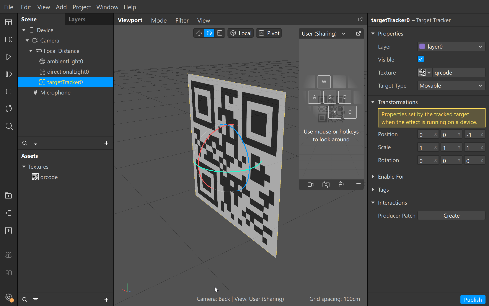
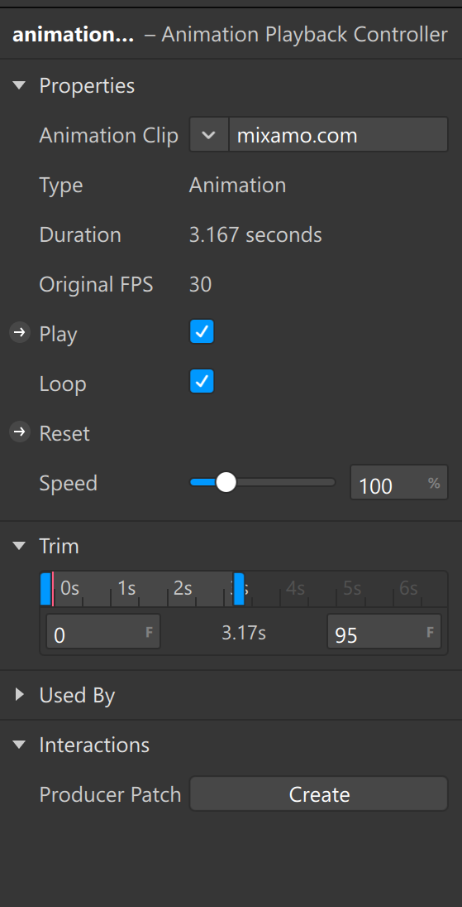
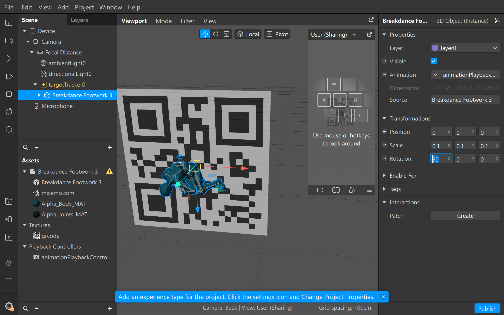
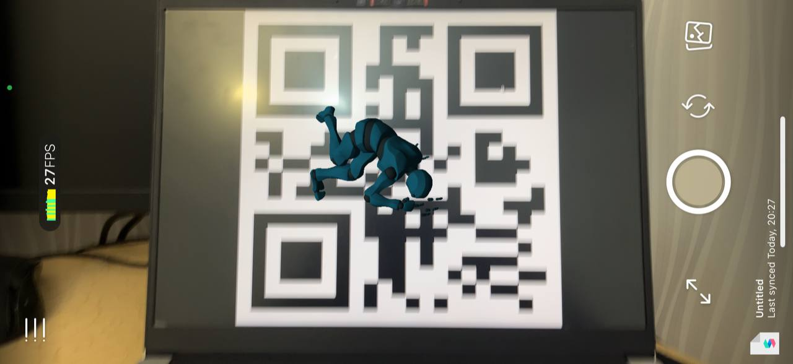

# Crearea unui efect AR cu ajutorul Target Tracker-ului

1. În baza recomandărilor documentației Meta Spark Studio, o imagine target trebuie să aibă paterne geometrice asimetrice cu contrast și rezoluție înalte. Ca și exemplu am generat o imagine a unui QR cod, fiind o imagine bună pentru situația dată.

2. Creăm un proiect nou, adăugăm un Target Tracker la scenă și importăm QR codul generat în proiect. Ulterior, setăm proprietatea Texture a trackerului ca și textura importată. Astfel, textura ar trebui să fie renderuită în scenă.

3. Importăm un 3D model cu o animație inclusă. Ca și exemplu am luat un model simplu cu o animație de dans pe loc de pe Mixamo, astfel mișcările modelului nu vor ieși din raza imaginii. 

4. Apăsăm componentul Animation și alegem opțiunea Create New Animation Controller. În acest moment, modelul va trece dintr-o T-poziție la animația aleasă precedent. By default, animația va rula în ciclu și automat se va porni.

5. Tragem modelul importat peste Target Trackerul din scenă și modificăm scara și rotația pentru ca modelul să fie setat corect. În exemplul dat am pus toate scale-urile la 0.1 și Rotation X la 90.

6. Salvăm proiectul, transmitem proiectul pe Mobile Meta Spark Player și deschidem imaginea QR pe tot ecranul calculatorului. În player, modelul va dansa deasupra imaginii QR.

