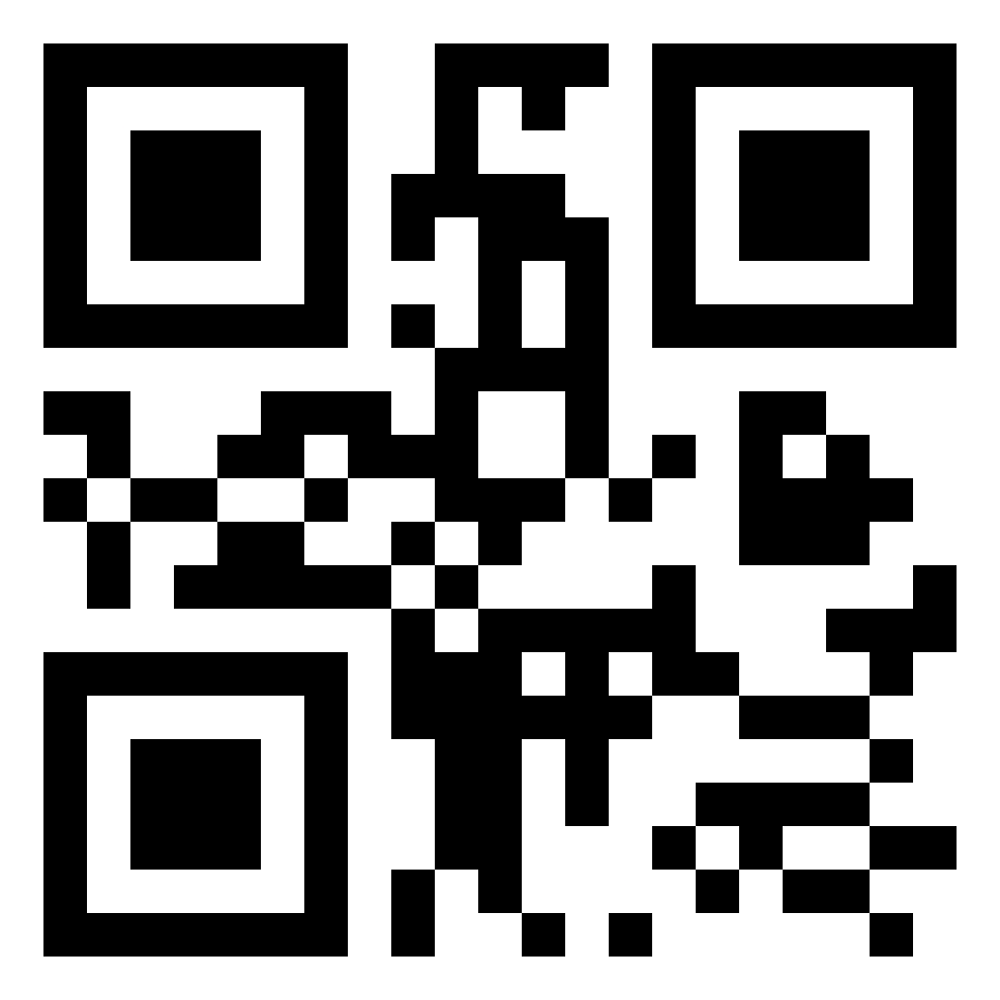
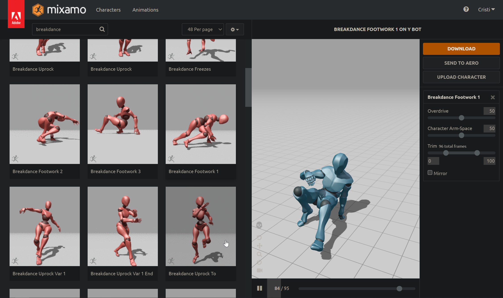
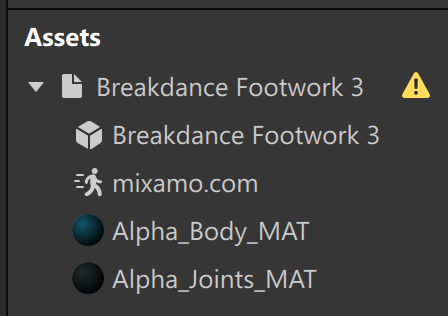

## Descrierea domeniului cercetat,

Deși fiind esențial pentru păstrarea istoriei unui popor și educația următoarelor generații, domeniul muzeelor nu a cunoscut inovații de foarte mult timp. Anume aceste inovații pot populariza domeniul dat și a reintroduce în vogă așa o acțiune simplă ca vizitarea unui muzeu. 

## Propunerea conceptului de adăugare a unui efect de augmentare sau virtualizare în domeniul analizat

Deși dioramele destul de bine își îndeplinesc rolul de a crea o scenă și a introduce vizitatorul în atmosfera unei perioade, acestea sunt destul de costisitoare, necesită mult timp pentru a fi create și nu rezistă în timp. Ca și alternativă pentru acestea pot fi folosite efecte de realitate augmentată, care pot îndeplini același rol, și chiar să succeadă dioramele după funcționalitate, precum folosirea animațiilor complexe a modelelor 3d și cu audio corespunzător.

## Proiectarea soluției

Pentru un asemenea efect este nevoie de a folosi un Target Tracker, care permite atașarea unui efect de o imagine anumită. În cazul unui muzeu acestea ar putea fi atât simple imagini QR, cât și designuri mai complexe care pot fi mai corespunzătoare tematicii expoziției. Deja aceste imagini vor fi imprimate și lipite de pereții muzeului într-o ordine specifică, iar vizitatorii vor folosi aplicația muzeului și scanând imaginile date vor da start efectelor AR.

## Realizarea ei cu ajutorul unui instrument software, care susține lucrul cu tehnologiile AR/VR, descrierea tehnologiei folosite,

În cazul dat a fost folosit instrumentul Meta Spark Studio, care permite crearea extrem de ușoară a efectelor AR. Acesta elimină tot lucrul de scanare a imaginii de pe camera telefonului și renderingul scenei, astfel un dezvoltator va trebui să se focuseze pur pe lucrul de creare a efectului AR. Instrumentul dat este creat de Meta, companie care a procurat Oculus, a investit și a cercetat mult domeniile VR și AR, astfel ei au destulă experiență pentru a crea un instrument calitativ pentru acest domeniu.

Cum am menționat mai sus, avem nevoie de o imagine cu paterne geometrice asimetrice cu contrast și rezoluție înalte. Ca și exemplu am generat o imagine a unui QR cod, fiind o imagine bună pentru situația dată.

Creăm un proiect nou, adăugăm un Target Tracker la scenă și importăm imaginea QR generată în proiect. Ulterior, setăm proprietatea Texture a trackerului ca și imaginea importată. Astfel, codul QR ar trebui să fie renderuit în scenă.

Importăm un 3D model cu o animație inclusă. Ca și exemplu am luat un model simplu cu o animație de dans pe loc de pe Mixamo, astfel mișcările modelului nu vor ieși din raza imaginii. 

Apăsăm componentul Animation și alegem opțiunea Create New Animation Controller. În acest moment, modelul va trece dintr-o T-poză la animația aleasă precedent. De obicei, animația va rula în ciclu și automat se va porni.

Tragem modelul importat peste Target Trackerul din scenă și modificăm scara și rotația pentru ca modelul să corespundă mărimii scenei și imaginii. În exemplul dat am pus toate scale-urile la 0.1 și Rotation X la 90.

## Testarea și implementarea soluției,

Pentru a testa soluția instalăm aplicația mobilă Mobile Meta Spark Player. Conectăm dispozitivul la calculator și folosim instrumentul Test on device pentru a transmite proiectul pe telefon. Imaginea QR o deschidem pe tot ecranul calculatorului și ne uităm la imaginea dată prin camera telefonului.  

## Prezentarea rezultatului/efectului.

Playerul detectează imaginea, pornește animația modelului și setează parametrii transform corect, astfel efectul a fost creat cu succes.

<!-- 

# Crearea unui efect AR cu ajutorul Target Tracker-ului

1. În baza recomandărilor documentației Meta Spark Studio, o imagine target trebuie să aibă paterne geometrice asimetrice cu contrast și rezoluție înalte. Ca și exemplu am generat o imagine a unui QR cod, fiind o imagine bună pentru situația dată.

2. Creăm un proiect nou, adăugăm un Target Tracker la scenă și importăm QR codul generat în proiect. Ulterior, setăm proprietatea Texture a trackerului ca și textura importată. Astfel, textura ar trebui să fie renderuită în scenă.

3. Importăm un 3D model cu o animație inclusă. Ca și exemplu am luat un model simplu cu o animație de dans pe loc de pe Mixamo, astfel mișcările modelului nu vor ieși din raza imaginii. 

4. Apăsăm componentul Animation și alegem opțiunea Create New Animation Controller. În acest moment, modelul va trece dintr-o T-poziție la animația aleasă precedent. By default, animația va rula în ciclu și automat se va porni.

5. Tragem modelul importat peste Target Trackerul din scenă și modificăm scara și rotația pentru ca modelul să fie setat corect. În exemplul dat am pus toate scale-urile la 0.1 și Rotation X la 90.

6. Salvăm proiectul, transmitem proiectul pe Mobile Meta Spark Player și deschidem imaginea QR pe tot ecranul calculatorului. În player, modelul va dansa deasupra imaginii QR.

 -->
