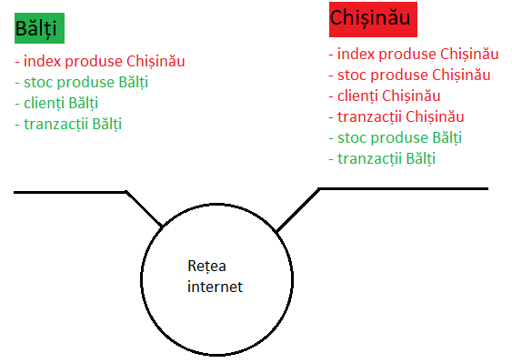
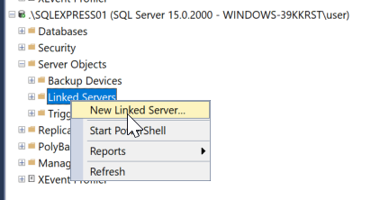
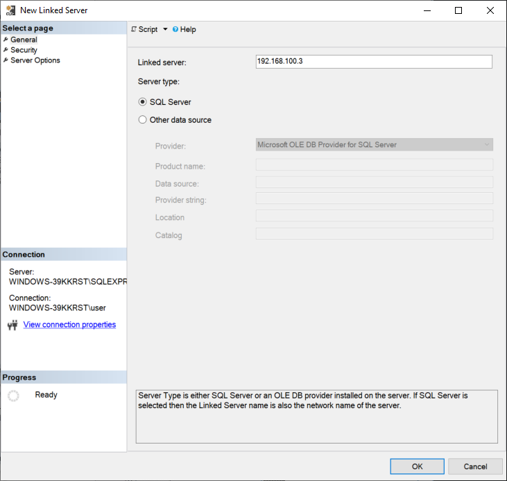
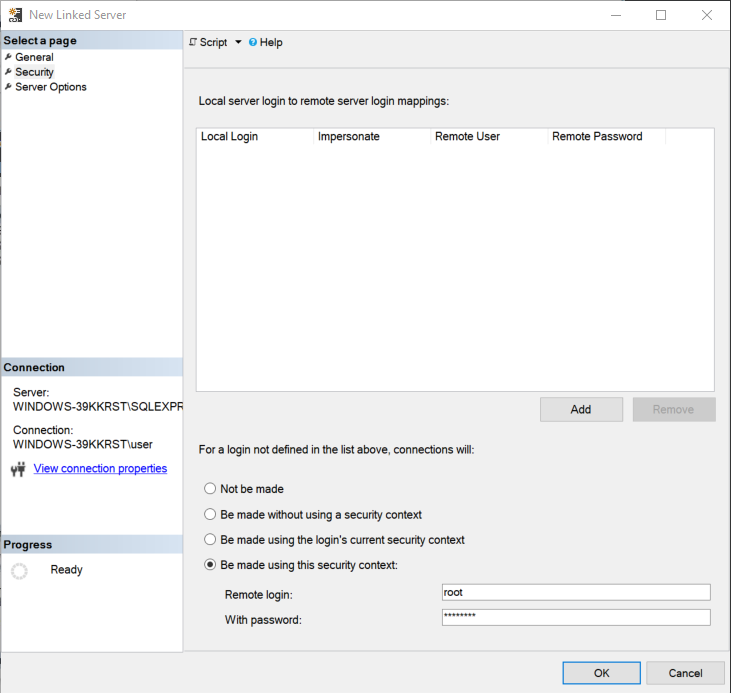
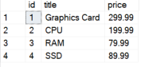
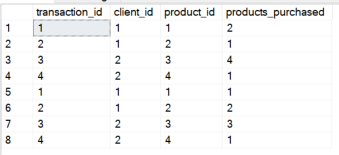
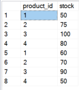

# Darea de seamă intermediară pentru prima atestare

Efectuata de: Țurcanu Cristian

## Analiza activităţii economice a organizaţiei descentralizată din domeniului concret din lumea reală

Ca și temă a fost ales 13 - depozit de date în sistemul de vînzare a tehnicii de calcul. Într-o asemenea situație, o companie ar putea avea mai multe filiale, în care  fiecare păstrează evidența produselor prezente, vândute și a clienților într-o bază de date locală. Ca și exemplu am luat magazinul atehno.md, care are filiale atât în orașul Chișinău, cât și în Bălți.

## Schema alocării geografice a subdiviziunilor organizaţiei descentralizate dindomeniului concret din lumea reală

Analog exemplului real, am avea două filiale ce se ocupă de vânzarea produselor de calcul, fiecare cu baza de date separată. Am putea presupune că oficiul din Chișinău este cel de bază, astfel acest oficiu ar avea nevoie de acces la tabelul tranzacțiilor și stocului produselor din Bălți pentru a analiza trendele de vânzare și a livra produsele necesare în filiale.

## Proiectarea bazei de date distribuite ca proiecţia pe schema alocării geografice a subdiviziunilor organizaţiei.

Spre exemplu am putea avea nevoie de un tabel de produse care va fi același între toate bazele de date, tabel local de clienți care nu este sincronizat, tabel ce ține evidența produselor și tabelul tranzacțiilor valabil extern în mod de citire. În final avem o asemenea schemă:



## Proiectarea bazelor de date locale pe fiecare nod al BDD

Urmează codul pentru proiectarea bazei de date pentru oficiul din Chișinău:

```sql
CREATE DATABASE SHOP_CHISINAU

CREATE TABLE Products (
    id INT PRIMARY KEY,
    title VARCHAR(255) NOT NULL,
    price DECIMAL(10, 2) NOT NULL
);

CREATE TABLE Clients (
    id INT PRIMARY KEY,
    name VARCHAR(255) NOT NULL,
    phone VARCHAR(15) NOT NULL
);

CREATE TABLE ProductStock (
    product_id INT PRIMARY KEY,
    stock INT NOT NULL,
    FOREIGN KEY (product_id) REFERENCES Products(id)
);

CREATE TABLE Transactions (
    transaction_id INT PRIMARY KEY,
    client_id INT,
    product_id INT,
    products_purchased INT NOT NULL,
    FOREIGN KEY (client_id) REFERENCES Clients(id),
    FOREIGN KEY (product_id) REFERENCES Products(id)
);
```

Desigur, baza de date din Bălți nu va avea tabel pentru produse pentru că ea depinde de cea din Chișinău, astfel această bază de date va fi proiectată în următorul punct. 

## Planificarea fragmentelor (partiţiilor) obiectelor necesare (fragmente, replici, linkuri, snapshoturi) pe fiecare nod al BDD;

Inițial, avem nevoie de a crea linkurile dintre servere. Deoarece fiecare avem nevoie să citească date de pe serverul celălalt, vom crea două linkuri:

- Deschidem SSMS, ne logăm în serverul SQL și apăsăm click dreapta pe `Server Objects/Linked Servers`, alegem opțiunea `New linked server`



- Înscriem adresa ip a calculatorului remote în secțiunea Linked server. Deoarece folosim pe ambele calculatoare SQL Server, alegem opțiunea dată în secțiunea Server type. De asemenea ne asigurăm că în configurator am permis conecțiunea la distanță, am setat portul 1433 și am făcut Port Forwarding în routerul rețelii de la distanță la portul dat pentru a permite accesul extern.



- În panoul security alegem opțiunea `Be made using this security context`, și completăm fieldurile de login și parolă cu credențialele create preventiv.



- Tastăm OK și repetăm procesul pe celălalt server. 

Pentru că tabelul de produse nu este modificat des, acesta poate fi transmis prin intermediul unui snapshot ce este recreat în fiecare zi. Spre exemplu:

```sql
CREATE OR ALTER PROCEDURE CreateSnapshot
AS
BEGIN
    DROP TABLE IF EXISTS Products;

    SELECT * INTO Products
    FROM [192.168.100.3].[SHOP_CHISINAU].[dbo].Products;

    ALTER TABLE Products
    ADD CONSTRAINT PK_Products PRIMARY KEY (id);
END;

EXEC CreateSnapshot;

SELECT * FROM Products;
```



Analog punctului de mai sus creăm celelalte tabele în baza de date din Bălți.

Ne întoarcem la baza de date din Chișinău.

De facto avem nevoie doar de acces de citire, astfel putem crea sinonime pentru acces comod la tabelele din Bălți.

```sql
CREATE SYNONYM Transactions_B FOR [192.168.100.4].[SHOP_BALTI].[dbo].Transactions;

CREATE SYNONYM ProductStock_B FOR [192.168.100.4].[SHOP_BALTI].[dbo].ProductStock;
```


De asemenea vom crea view-uri care permit citirea combinată a datelor din tabelele din Bălți și Chișinău:

```sql
CREATE VIEW CombinedTransactionsView AS
SELECT * FROM Transactions
UNION ALL
SELECT * FROM Transactions_B;

SELECT * FROM CombinedTransactionsView;
```



```sql
CREATE VIEW CombinedProductStockView AS
SELECT * FROM ProductStock
UNION ALL
SELECT * FROM ProductStock_B;

SELECT * FROM CombinedProductStockView;
```


