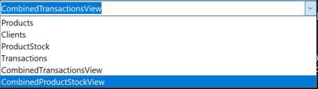

Pentru partea a doua a laboratorului am folosit tehnoloia ADO.NET din limbajul C#. Ea permite crearea ușoară a conexiunilor cu bazele de date, chiar dacă nu se cunoaște conținutul tabelelor. Pentru interfață am folosit Windows Forms, care lucrează destul de bine cu ADO.NET.

Datele din tabele le obținem cu ajutorul clasei SqlDataAdapter, care primește conexiunea la baza de date și un query select pentru a primi datele inițiale.

Pentru ilustrarea datelor folosim controlul DataGridView. Acesta arată datele într-o formă comodă și este compatibil cu tipurile de date obținute în urma interacțiunii cu baza de date.


DataGridView oferă și posibilități de modificare a datelor, acestea salvându-se automat în baza de date cu ajutorul event-urilor și metodei SqlDataAdapter.Update(DataTable table).


De asemenea creăm un combobox pentru a selecta tabelul curent. Datele pentru combobox le obținem deodată din baza de date, și acestea conțin atât tabele, cât linkuri și view-uri.



Codul sursă a programului este următorul:

```csharp
using System.Data;
using System.Data.SqlClient;

namespace lab2;

public partial class Form1 : Form
{
    private SqlConnection connection;
    private SqlDataAdapter adapter;
    private DataTable dataTable;
    private DataGridView dataGridView;
    private ComboBox comboBox;
    private Panel panel;

    public Form1()
    {
        InitializeComponent();
        panel = new Panel { Dock = DockStyle.Fill };
        this.Controls.Add(panel);

        comboBox = new ComboBox { Dock = DockStyle.Bottom };
        comboBox.SelectedIndexChanged += ComboBox_SelectedIndexChanged;
        panel.Controls.Add(comboBox);

        dataGridView = new DataGridView { Dock = DockStyle.Fill, Location = new Point(10, 40), AllowUserToAddRows = true, AllowUserToDeleteRows = true };
        dataGridView.UserAddedRow += (_,_) => UpdateAdapter();
        dataGridView.UserDeletedRow += (_,_) => UpdateAdapter();
        dataGridView.CellValueChanged += (_,_) => UpdateAdapter();
        dataGridView.RowValidated += (_,_) => UpdateAdapter();
        panel.Controls.Add(dataGridView);

        string connectionString = @"introduceti connection string";
        connection = new SqlConnection(connectionString);

        adapter = new SqlDataAdapter($"SELECT * FROM Clients", connection);
        SqlCommandBuilder commandBuilder = new SqlCommandBuilder(adapter);
        dataTable = new DataTable();
        adapter.Fill(dataTable);
        dataGridView.DataSource = dataTable;

        connection.Open();
        DataTable schema = connection.GetSchema("Tables");
        foreach (DataRow row in schema.Rows)
        {
            comboBox.Items.Add(row[2].ToString());
        }
        connection.Close();
    }

    private void UpdateAdapter() {
        try
        {
            adapter.Update(dataTable);
        }
        catch (Exception ex)
        {
            MessageBox.Show(ex.Message);
        }
    }

    private void ComboBox_SelectedIndexChanged(object sender, EventArgs e)
    {
        string selectedTable = comboBox.SelectedItem.ToString();
        adapter = new SqlDataAdapter($"SELECT * FROM {selectedTable}", connection);
        dataTable = new DataTable();
        adapter.Fill(dataTable);
        dataGridView.DataSource = dataTable;
    }
}
```