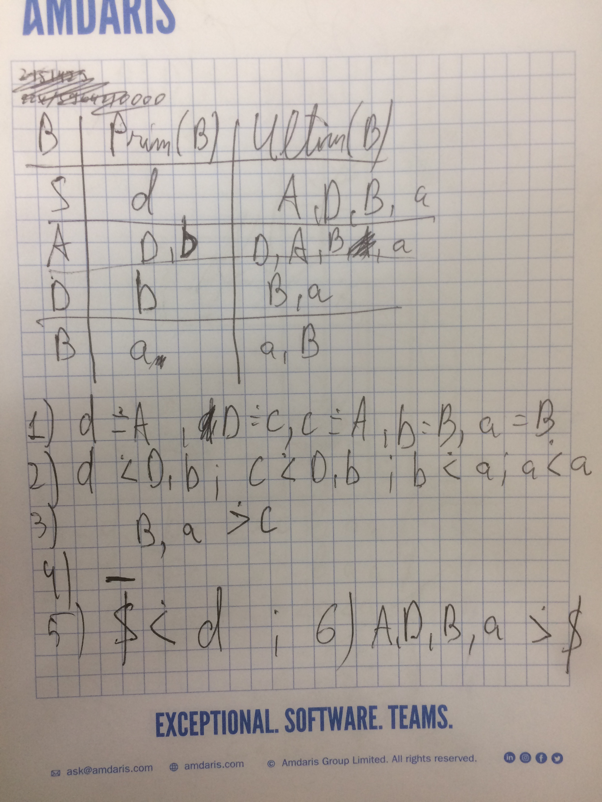
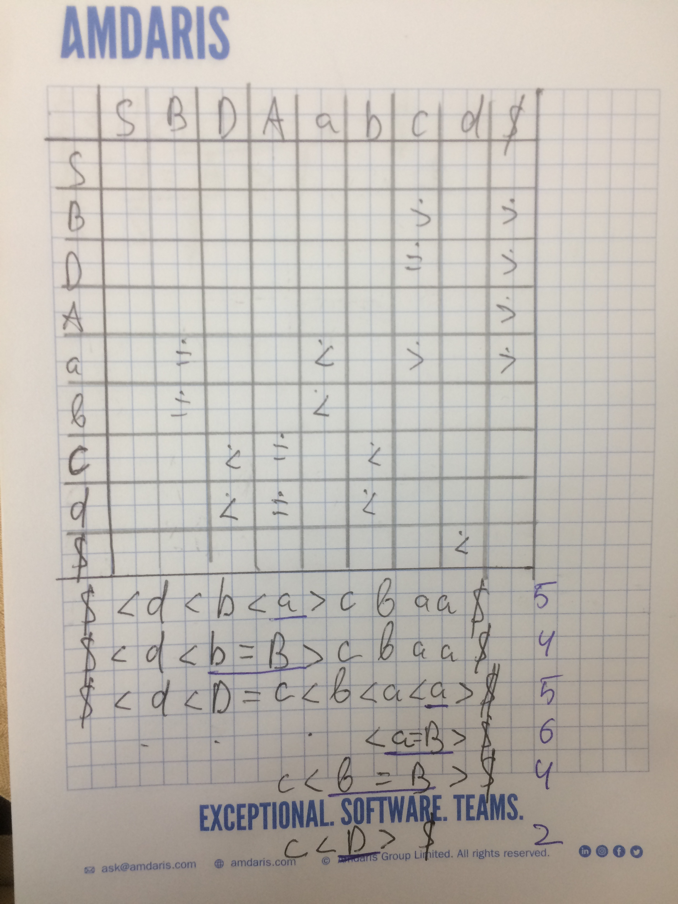
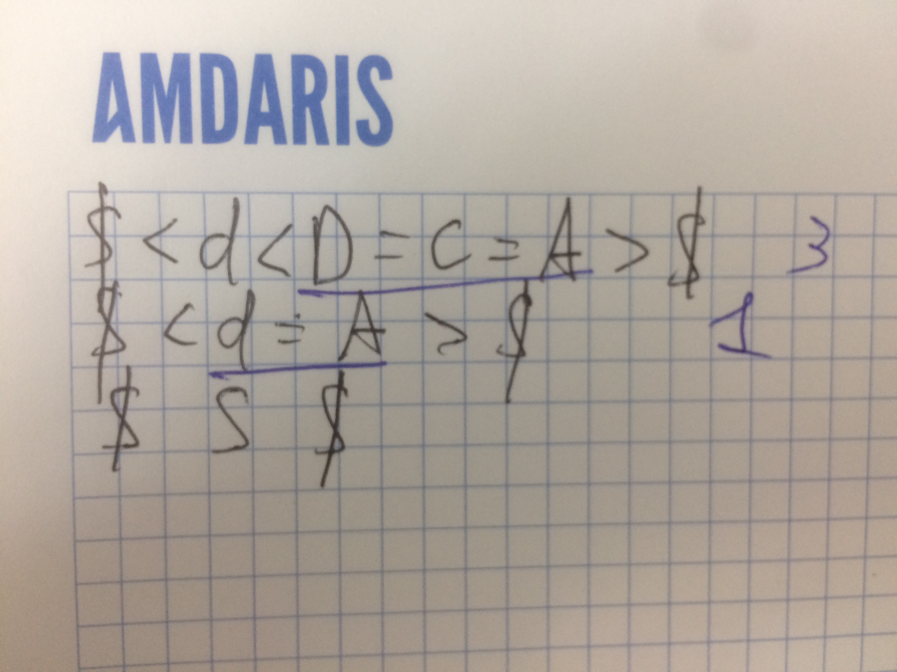

Fie gramatica independentă de context 

$G = (VN, VT, P, S), \\\\
V_N = \\{S, B, D, A\\}, \\\\
V_T = \\{a, b, c, d\\},\\\\
P = \\{\\\\
1\. S → dA  \\\\
2\. A → D  \\\\
3\. A → DcA  \\\\
4\. D → bB  \\\\
5\. B → a  \\\\
6\. B → aB  \\\\
\\}$

Construiți matricea relaţiilor de precedenţă şi efectuați analizaza şirului **dbacbaa**.

