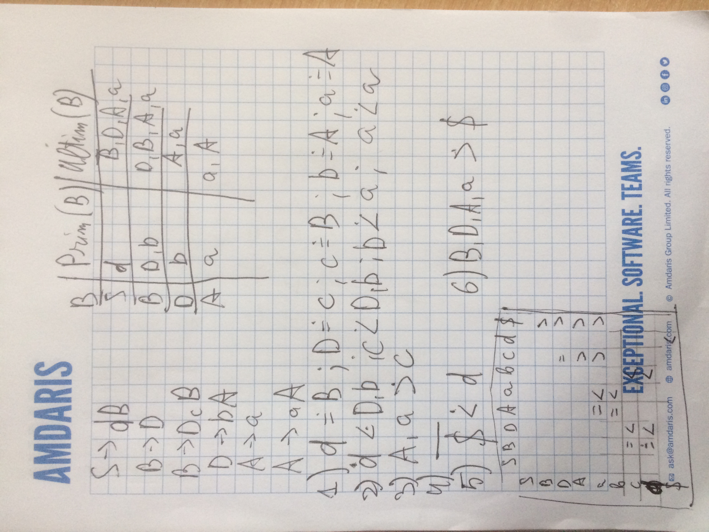
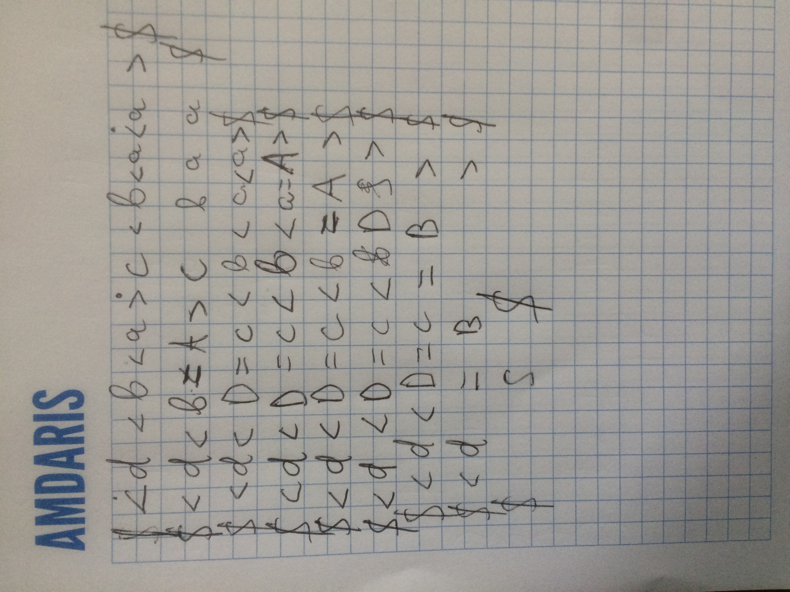

Turcanu Cristian, IA1901

Lucrare de laborator nr.3

Varianta 1

Fie gramatica independenta de context 

$ G = (V_N, V_T, P, S),  \\\\
V_N=\\{ S, B, D, A \\},\\\\
V_T = \\{ a, b, c, d \\},  \\\\
P = \\\\
\\{ \\\\
1\. S \rightarrow dB, \\\\
2\. B \rightarrow D, \\\\
3\. B \rightarrow DcB, \\\\
4\. D \rightarrow bA, \\\\
5\. A \rightarrow a, \\\\
6\. A \rightarrow aA  \\\\
\\}
$

Construiti matricea relatiilor de precedenta si efectuati analiza sirului **dbacbaa**

