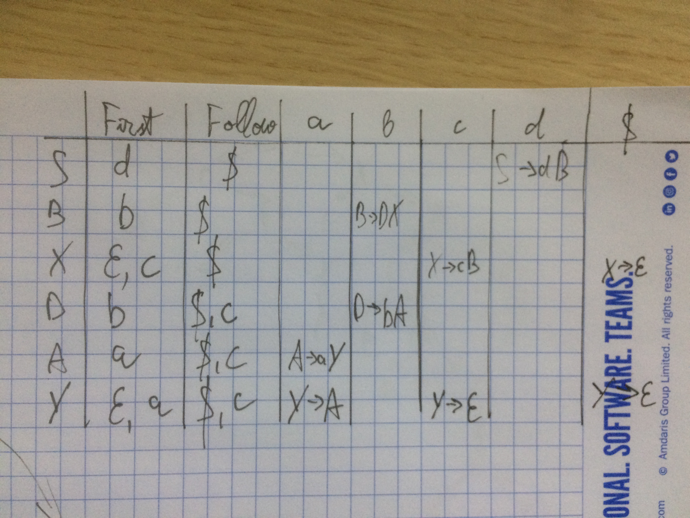
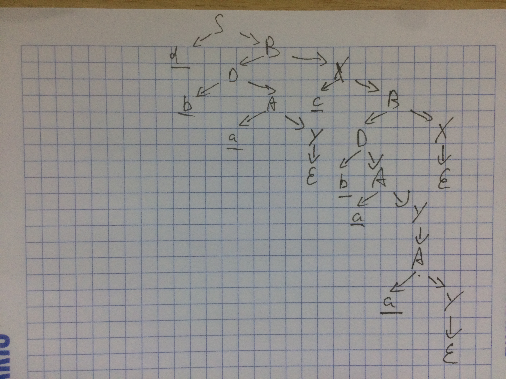

LL(1) 001.  Este dată gramatica independentă de context.

$ P = \\{ \\\\
S → dB      \\\\
B → D | DcB	\\\\
D → bA  \\\\
A → a | aA\\\\
\\}\\\\
$

Să se construiască tabelul de analiză LL(1) şi să se analizeze şirul dbacbaa. Să se deseneze arborele de derivare.

