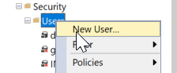
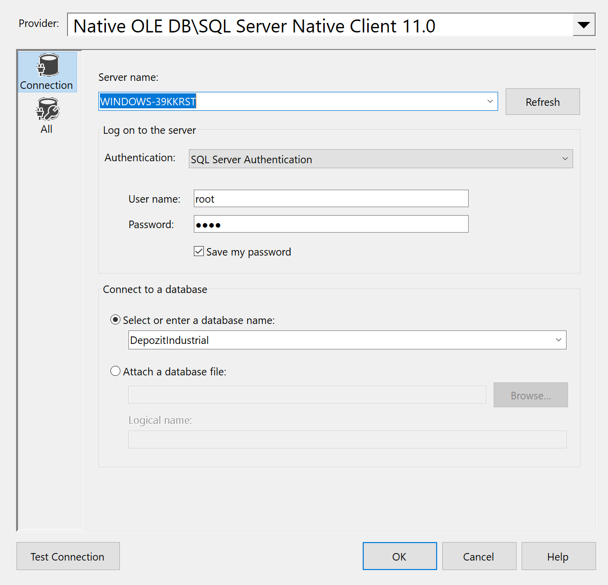
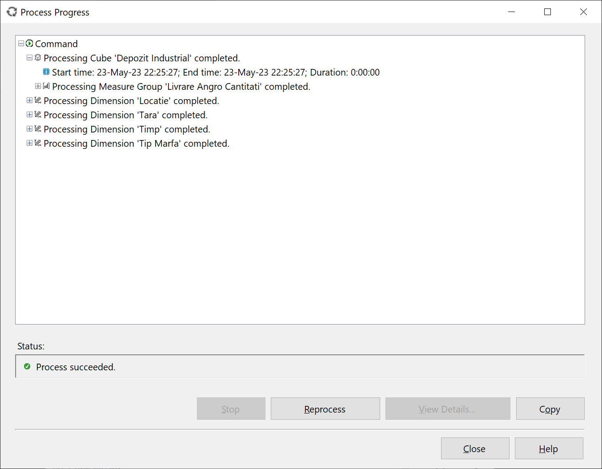
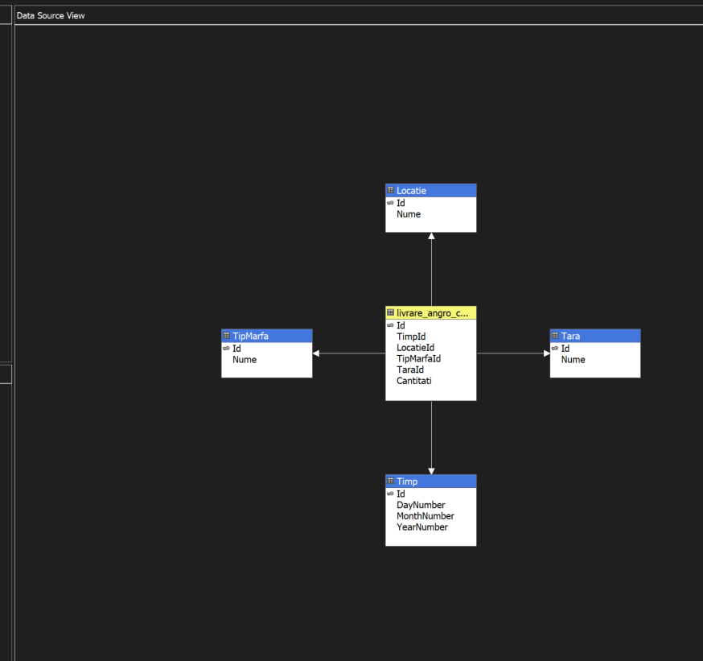
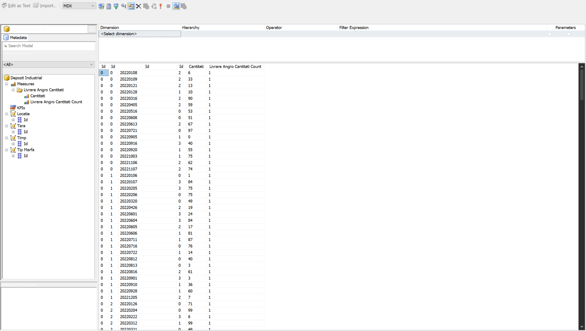

# Exemplul Adventure Works

Instalăm Microsoft SQL Server 2019:

Alegem varianta New SQL Server standalone installation

Introducem cheia pentru o licență Enterprise, altfel nu vom obține instrumentele necesare: HMWJ3-KY3J2-NMVD7-KG4JR-X2G8G


Alegem Database Engine, Analysis și Integation Services


Alegem modul Multidimensional and Data Mining și adăugăm utilizatorul curent


Instalăm

Instalăm Sql Server Management Studio, pornim și ne conectăm la SQL serverul default pentru userul curent


Descărcăm baza de date AdventureWorksDW2019.bak și plasăm fișierul în folderul C:\Program Files\Microsoft SQL Server\MSSQL15.MSSQLSERVER\MSSQL\Backup

Restabilim baza de date Adventure Works prin SSMS, alegând opțiunea Restore Database și specificând calea spre fișier 


Setăm modul de logare pentru SQL Server SQL and Windows Authentication mode și restartăm serverul prin configurator


Creăm loginul și userul pentru conecțiune la baza de date, important e să fie un SQL user și să aibă parolă





Testăm conexiunea SQL și accesul la baza de date prin SSMS


Instalăm Visual Studio 2022, împreună cu pachetul "Data storage and processing"


Instalăm extensiile serviciilor de Analysis, Reporting și Integration pentru Visual Studio

Deschidem Visual Studio și creăm un proiect de tip Analysis Services Multidimensional Project


Creăm un nou Data Source, unde indicăm baza de date și credențialele userului SQL creat


Creăm un nou Data Source View, în care indicăm Data Source-ul creat mai sus și tabelele de dimensiuni și fapte analizate. Pentru laboratorul dat vor fi folosite tabelul de fapte FactResellerSales și tabelele de dimensiuni conectate la el


Creăm un nou cub de date, important e să separăm tabelele de fapte și de dimensiuni


# Baza de date proprie

În primul rând avem nevoie să creăm baza de date. Cu ajutorul următorului cod am creat tabelele și am introdus date:

```sql
create database DepozitIndustrial;

create table Timp (
	Id int primary key,
	DayNumber int,
	MonthNumber int,
	YearNumber int
);

create table Locatie (
	Id int primary key,
	Nume Varchar(255)
);

create table TipMarfa (
	Id int primary key,
	Nume Varchar(255)
);

create table Tara (
	Id int primary key,
	Nume Varchar(255)
);

insert into Locatie values (0, 'Depozit angro');
insert into Locatie values (1, 'Depozit vanzari');
insert into Locatie values (2, 'Depozit livrare');

insert into TipMarfa values (0, 'Metalurgie');
insert into TipMarfa values (1, 'Medicina');
insert into TipMarfa values (2, 'Agricultura');
insert into TipMarfa values (3, 'Alimentara');

insert into Tara values (0, 'Franta');
insert into Tara values (1, 'Anglia');
insert into Tara values (2, 'Spania');
insert into Tara values (3, 'Germania');
insert into Tara values (4, 'Austria');


declare @month int = 1;
declare @day int = 1;

while @day < 32
begin
	insert into Timp values (20220000 + @month * 100 + @day, @day, @month, 2022);
	set @day = @day+1;
end
-- analog si restul lunilor

create table livrare_volum(
	Id int primary key,
	TimpId int foreign key references Timp(id),
	LocatieId int foreign key references Locatie(id),
	TipMarfaId int foreign key references TipMarfa(id),
	TaraId int foreign key references Tara(id),
	Volum int
);

create table livrare_cantitati(
	Id int primary key,
	TimpId int foreign key references Timp(id),
	LocatieId int foreign key references Locatie(id),
	TipMarfaId int foreign key references TipMarfa(id),
	TaraId int foreign key references Tara(id),
	Cantitati int
);

-- analog si restul tabelelor

declare @month int = 1;
declare @day int = 1;
declare @counter int = 1;

while @day < 29 and @month < 13
begin
	insert into livrare_volum values (
		@counter,
		20220000 + @month * 100 + @day, 
		ABS(CHECKSUM(NEWID()) % 3), 
		ABS(CHECKSUM(NEWID()) % 4), 
		ABS(CHECKSUM(NEWID()) % 5), 
		ABS(CHECKSUM(NEWID()) % 100)
		);
	set @day = @day+1;
	set @counter = @counter + 1;

	if @day >= 29 
	begin
		set @day = 1;
		set @month = @month + 1
	end
end

-- analog si restul tabelelor
```

Mai departe trecem prin aceeași pași ca și în cazul Adventure Works - creăm utilizatorul cu drept de citire, creăm proiectul în Visual Studio, specificăm sursa de date, Data Source View-ul și formăm cubul de date:








