# Crearea pachetului ETL în baza exemplului AdventureWorks

Instalăm programele necesare din laboratorul 1. Acolo se includ pachetele necesare și pentru crearea pachetului ETL. Adițional, descărcăm arhiva "SSIS Tutorial Files", din care vom folosi orice fișier din directoriul Sample Data: https://www.microsoft.com/en-us/download/details.aspx?id=56827 .

Deschidem Visual Studio, alegem crearea unui proiect nou și alegem template-ul Integration Services Project. Setăm denumirea, calea spre proiect, și îl creăm.

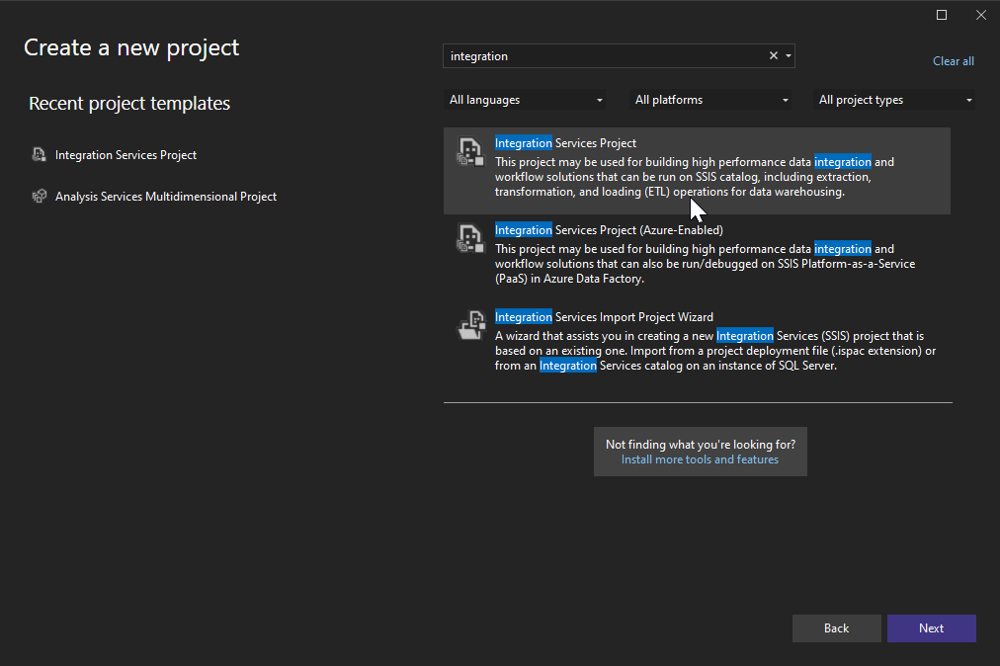

Analizând fișierul ales, observăm că prima și ultima coloană conțin date noi, iar cele două din mijloc au relații cu două tabele din baza de date Adventure Works, astfel vom avea nevoie de două operațiuni de Lookup pentru a le conecta.

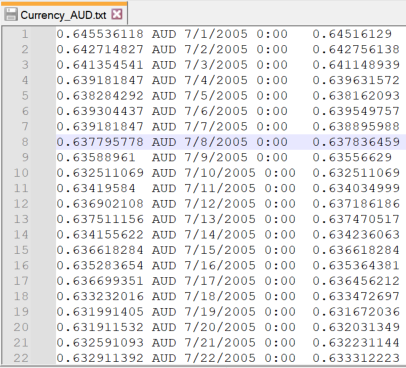

În primul rând, avem nevoie să introducem fișierul în proiect, astfel creăm un nou Connection Manager de tip FlatFile. 

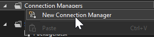

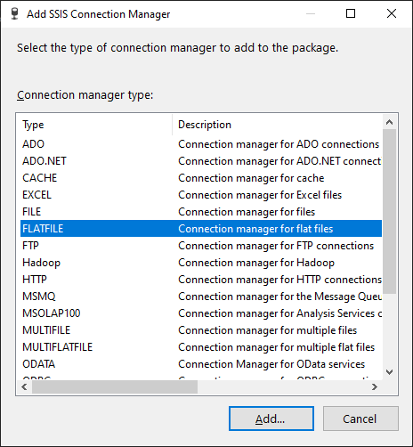

Deoarece fișierul nu conține denumiri de coloane în primul rând, scoatem bifa respectivă.

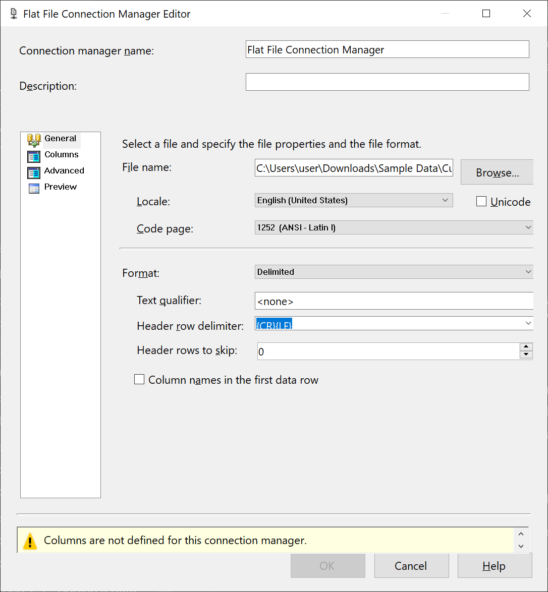

În categoria Advanced setăm denumirile coloanelor AverageRate, CurrencyID, CurrencyDate și EndOfDayRate, și respectiv tipurile de date float [DT_R4], unicode string [DT_WSTR], database date [DT_DBDATE] și float [DT_R4]. Apăsăm OK.

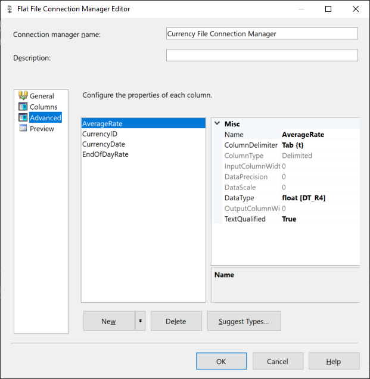

Mai departe configurăm conecțiunea la baza de date. Analog exemplului precedent creăm o conecțiune de tipul OLE DB și setăm credențialele necesare pentru a stabili conecțiunea la baza de date. Verificăm conecțiunea și continuăm.

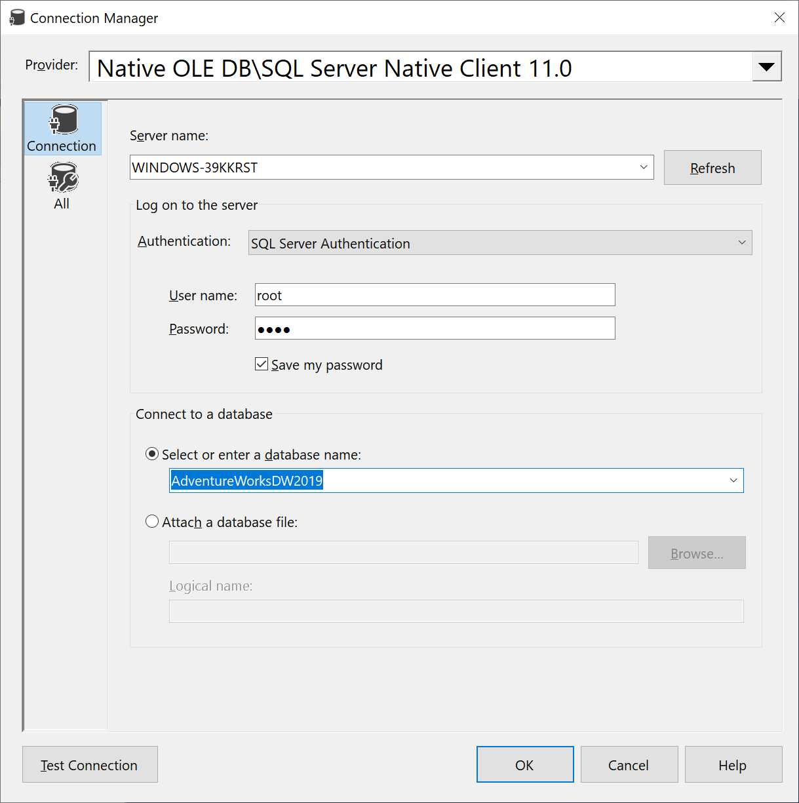

În continuare vom crea Data Flow-ul care va efectua conecțiunea dintre datele fișierului și a bazei de date. Deschidem fișierul Package.dtsx din Solution Explorer, iar în fereastra deschisă în panoul Control Flow tragem un element de tip Data Flow Task, numindu-l Extract Sample Currency Data. 

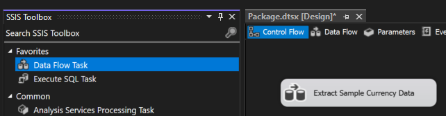

Mai departe deschidem panoul Data Flow și adăugăm un component de tip Flat File Source. Îl numim tot Extract Sample Currency Data, iar după dublu click alegem Connection Manager-ul pentru fișier în combo box-ul din fereastră.

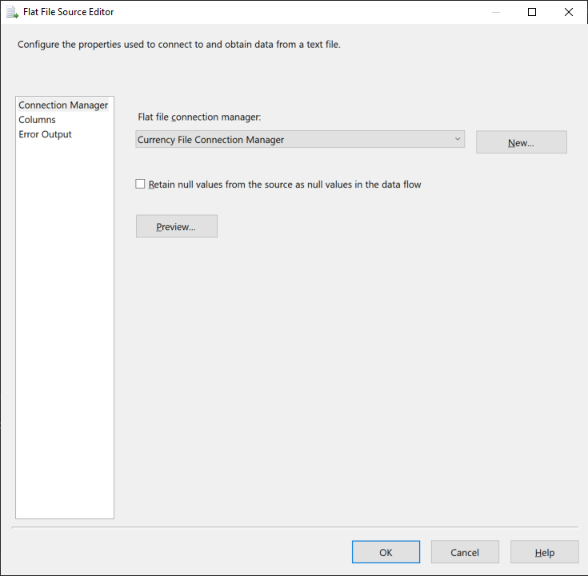

Închidem fereastra și tragem un component de tip Lookup, numindu-l Lookup Currency Key. Unim săgeata albastră a componentului precedent si deschidem fereastra de configurare a lookup-ului. Alegem opțiunile Full cache și OLE DB connection manager, iar în fereastra Connection selectăm connection manager-ul la baza de date Adventure Works, alegem opțiunea User results of an SQL query și folosim query-ul dat:

```sql
SELECT * FROM [dbo].[DimCurrency]
WHERE [CurrencyAlternateKey]
IN ('ARS', 'AUD', 'BRL', 'CAD', 'CNY',
    'DEM', 'EUR', 'FRF', 'GBP', 'JPY',
    'MXN', 'SAR', 'USD', 'VEB')
```

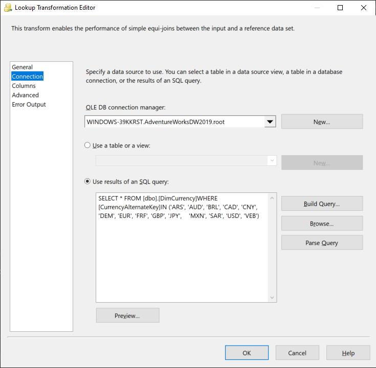

Facem preview și verificăm dacă query-ul lucrează. În fereastra Columns tragem rândul CurrencyId din prima coloană peste CurrencyAlternateKey din a doua coloană pentru a forma o legătură. De asemenea apăsăm pe checkbox-ul de lângă CurrencyKey.

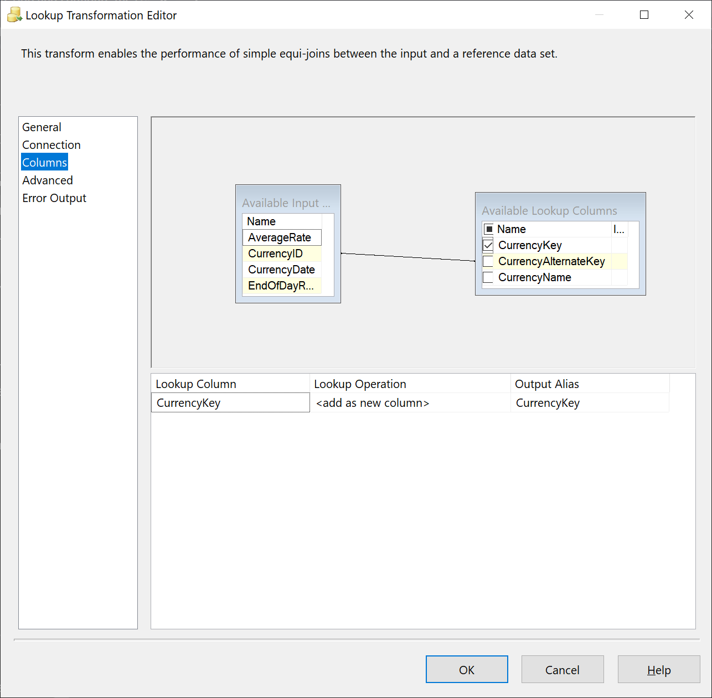

Analog creăm și lookup-ul Lookup Date Key, unind săgeata albastră a componentului precedent cu acesta, folosind Partial cache în loc de Full cache și alegem tabelul [dbo].[DimDate] în fereastra Connection. În categoria Columns tragem rândul CurrencyDate peste FullDateAlternateKey pentru a forma legătura și apăsăm checkbox-ul lângă DateKey.

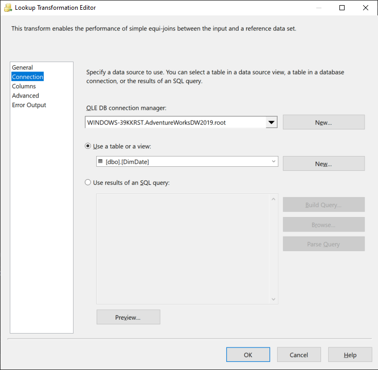

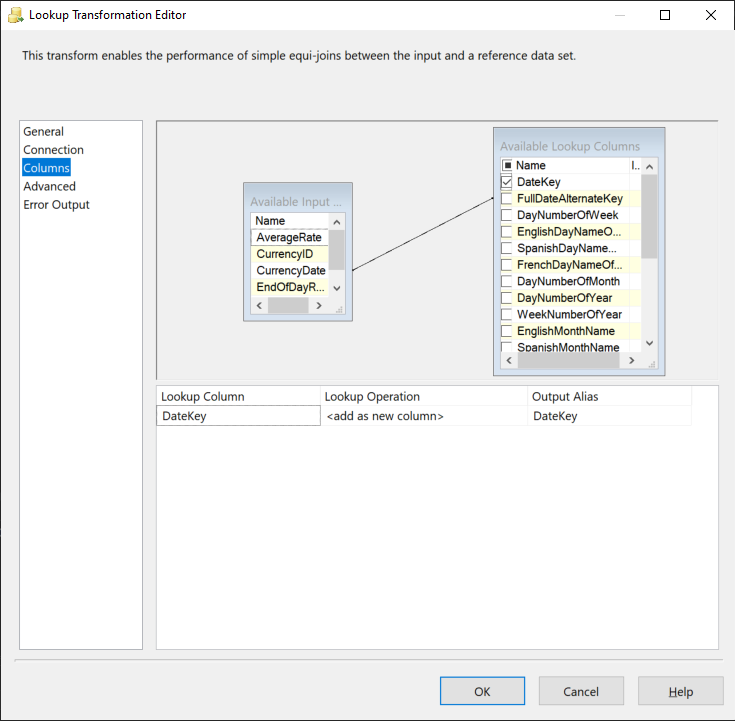

În final creăm componenul destinație pentru date. Tragem componenul OLE DB Destination și tragem săgeata albastră a componentului precedent peste acesta. De asemenea îl redenumim în Sample OLE DB Destination. După dublu clic ne asigurăm că este aleasă conecțiunea la baza de date AdventureWorks. De asemenea, în cazul în care în baza de date există tabelul cu denumirea NewFactCurrencyRate, atunci îl ștergem pentru că îl vom crea de la zero. Apăsăm al doilea buton New pentru a crea tabelul și schimbăm denumirea tabelului din query la NewFactCurrencyRate. Închidem fereastra, după care tabelul ales trebuie să se schimbe la NewFactCurrencyRate.

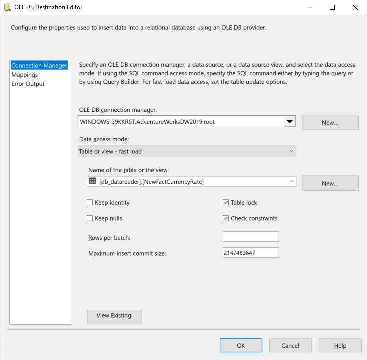

Deschidem categoria Mappings și verificăm dacă legăturile s-au format corect.

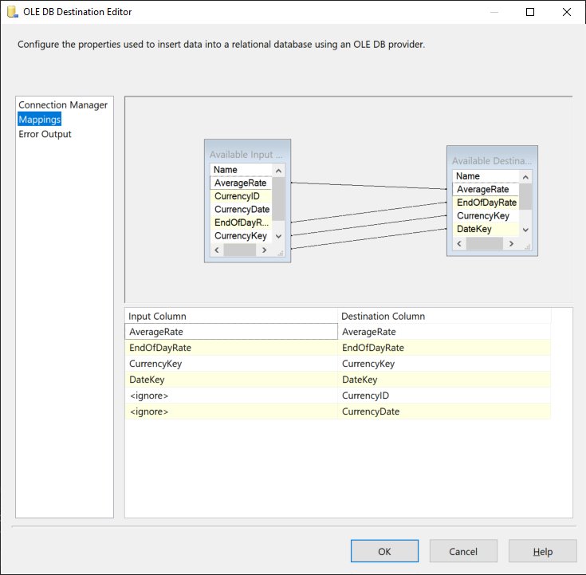

Închidem fereastra. În final trebuie să obținem o asemenea schemă:

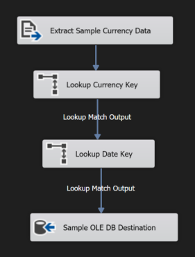

Apăsăm meniul Debug și alegem opțiunea Start Debugging. Fereastra trebuie să se schimbe, iar dacă fiecare operație arată că au fost create rânduri noi atunci pachetul a fost creat cu succes.

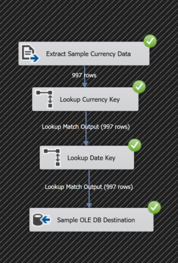