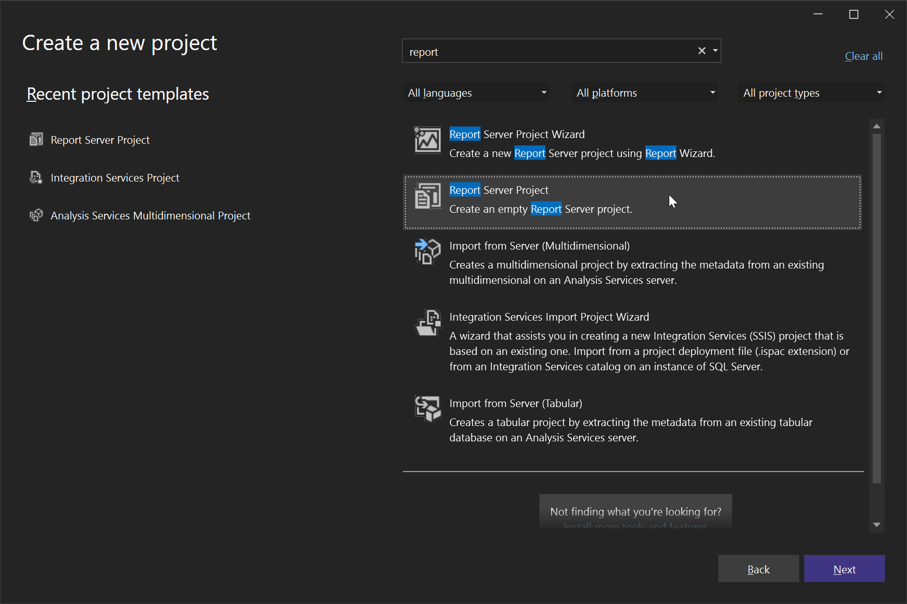
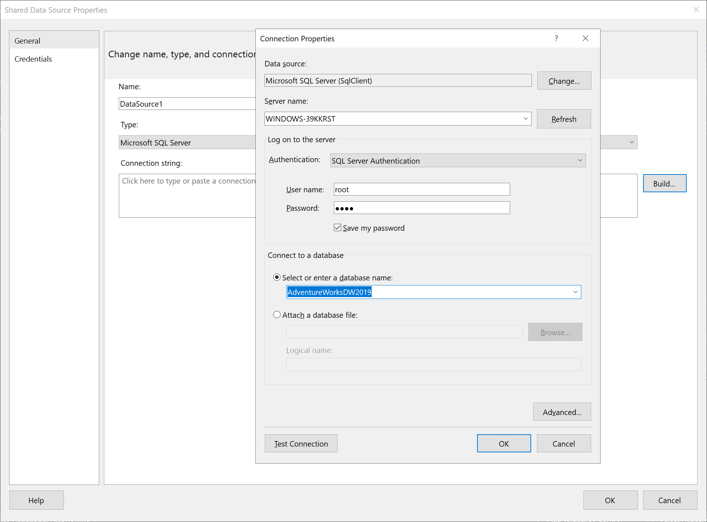
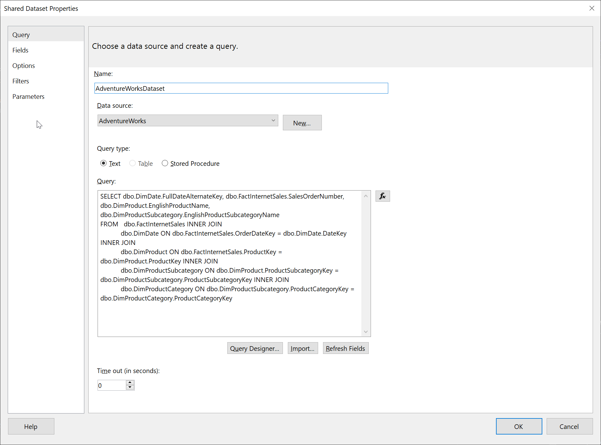
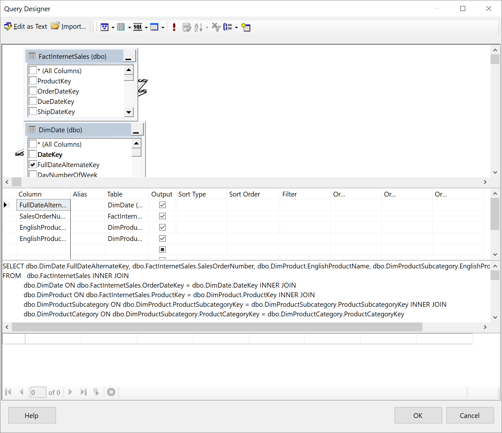
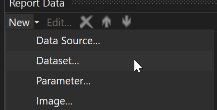
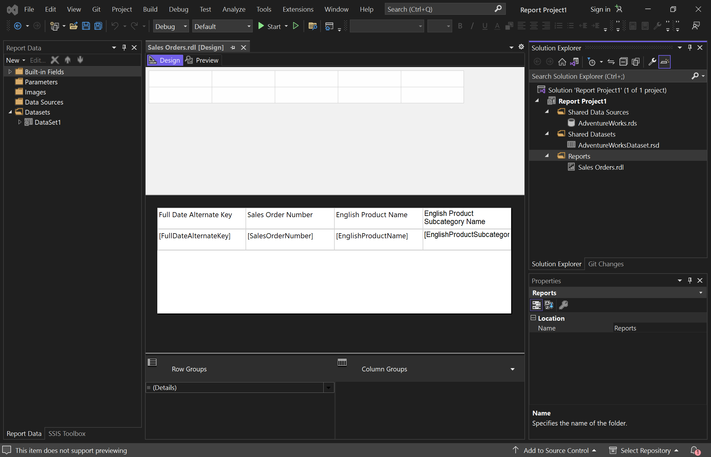
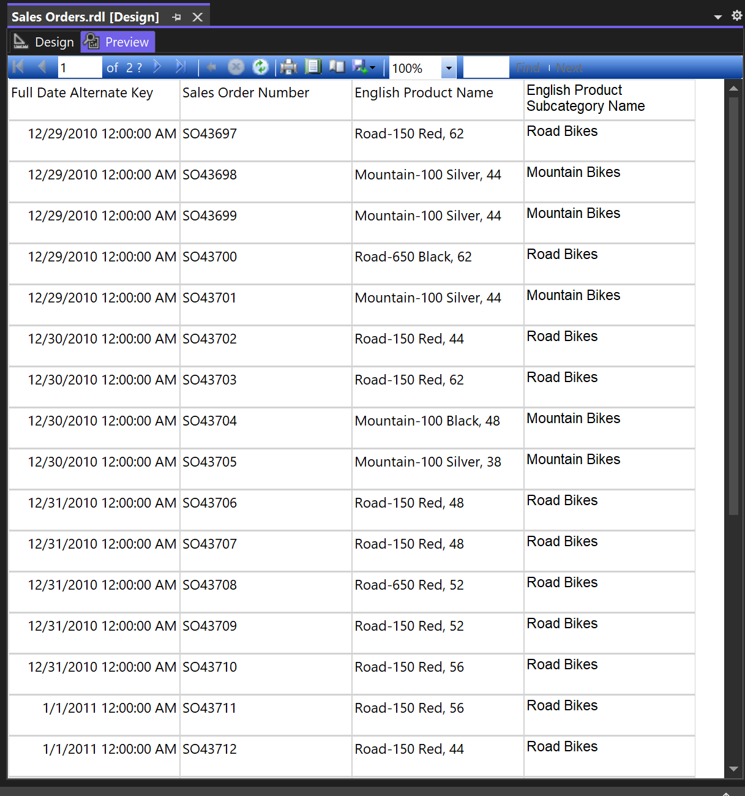

# Crearea unui raport în sistemul SSRS

În primul rând instalăm programele necesare din laboratorul 1. Acolo se includ pachetele necesare și pentru crearea rapoartelor. 

Deschidem Visual Studio, creăm un proiect în baza template-ului Report Server Project și îl deschidem.

Mai departe avem nevoie să creăm un Data Source pentru a ne conecta la baza de date. Procesul este aproape tot același ca și în primele 2 laboratoare: alegem serverul sql, modul de autentificare, credențialele și baza de date pentru a forma connection string-ul și a asigura conexiunea.

Mai departe creăm un dataset, în care specificăm query-ul, tabelul sau procedura prin care vom obține datele. În cazul dat am creat un query, și pentru asta SSRS oferă funcționalitatea de query builder, care permite crearea printr-o interfață grafică a acestuia. Din păcate, query builder-ul are probleme în cazul în care se folosește operațiunea group by, de aceea am folosit pur și simplu un select cu câteva join-uri.

În final creăm raportul în baza datelor din dataset. Adăugăm raportul prin opțiunile Add -> New item -> Report și îl numim după situație. Deschidem raportul și adăugăm dataset-ul în coloana Report Data ca să putem utiliza field-urile acestuia, și apoi le tragem spre fereastra de design. 

Interfața de design foarte tare se aseamănă cu interfața de creare a raporturilor în Microsoft Access, așa că design-ul nu va lua mult timp. Apăsăm Preview ca să verificăm conținutul raportului.

