În primul rând instalăm SQL Serverul și baza de date AdventureWorks după instrucțiunile din laboratorul 1. Adițional instalăm PowerBI Desktop, prin care și vom crea rapoartele necesare: https://www.microsoft.com/en-us/download/details.aspx?id=58494

Mai departe vom adăuga o conexiune nouă la baza de date. Apăsăm butonul SQL Server din toolbar-ul de sus și introducem numele serverului și bazei de date, lăsând aleasă opțiunea Import pentru a forma cache intern în PowerBI (util în cazul în care datele se schimbă rar). 

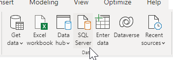

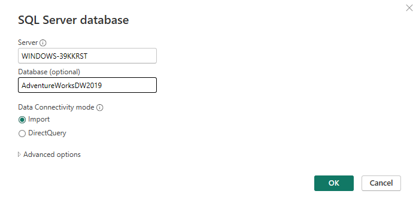

Mai departe alegem tabelele care vor fi folosite în raport, în cazul dat iau tabelele alăturate FactInternetSales:

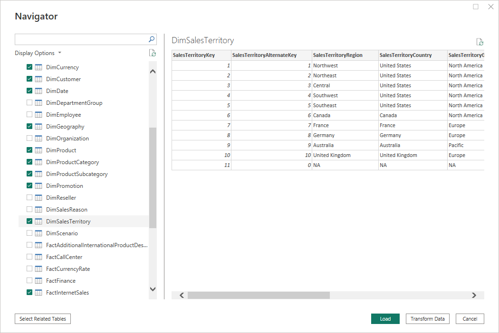

Alegem panoul Model view din stânga ferestrei ca să vedem legăturile formate dintre tabele. Aici de asemenea pot fi ascunse coloanele care nu vor fi utile pentru crearea rapoartelor, precum coloanele pentru chei.

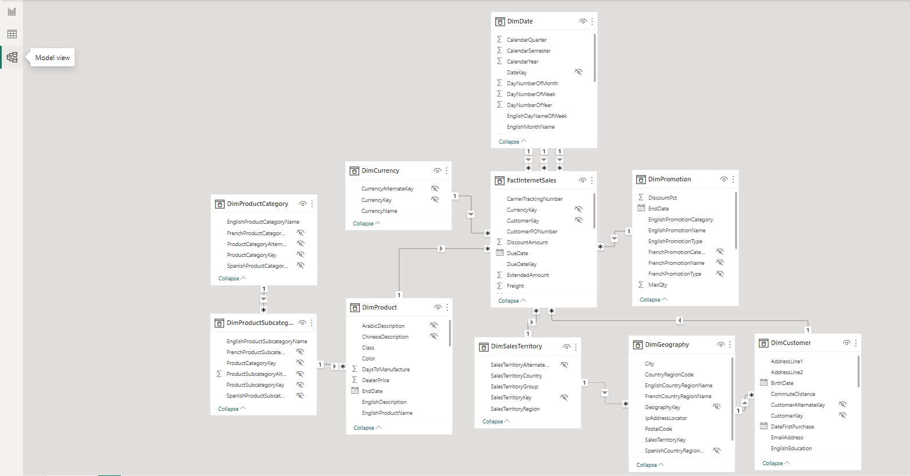

Acum suntem gata pentru a forma raportul. Alegem panoul Report View și selectăm Text Box. Adăugăm denumirea raportului și îl stilizăm analog sistemului MS Word.

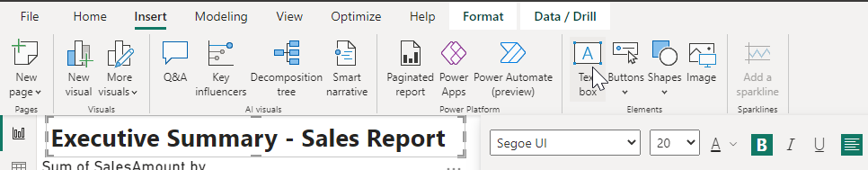

Mai departe alegem coloanele SalesAmount din tabelul FactInternetSales și MonthNumberOfYear din DimDate. Alegem tabelul de tip AreaChart și tragem MonthNumberOfYear de pe Y-axis pe X-axis. Astfel am format un tabel ce reprezintă vânzările în dependență de lunile anului.

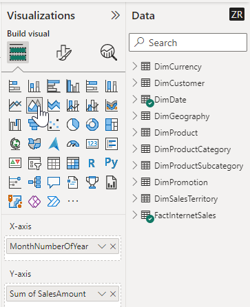

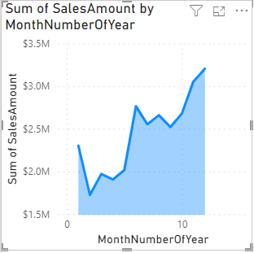

Observăm că în luna decembrie se vând cele mai multe produse, urmată de iunie și august.

În continuare vom adăuga o hartă care va reprezenta vânzările în baza de regiune. În primul rând intrăm în File -> Options and Settings -> Options -> Global -> Security și bifăm Use map and filled map visuals.

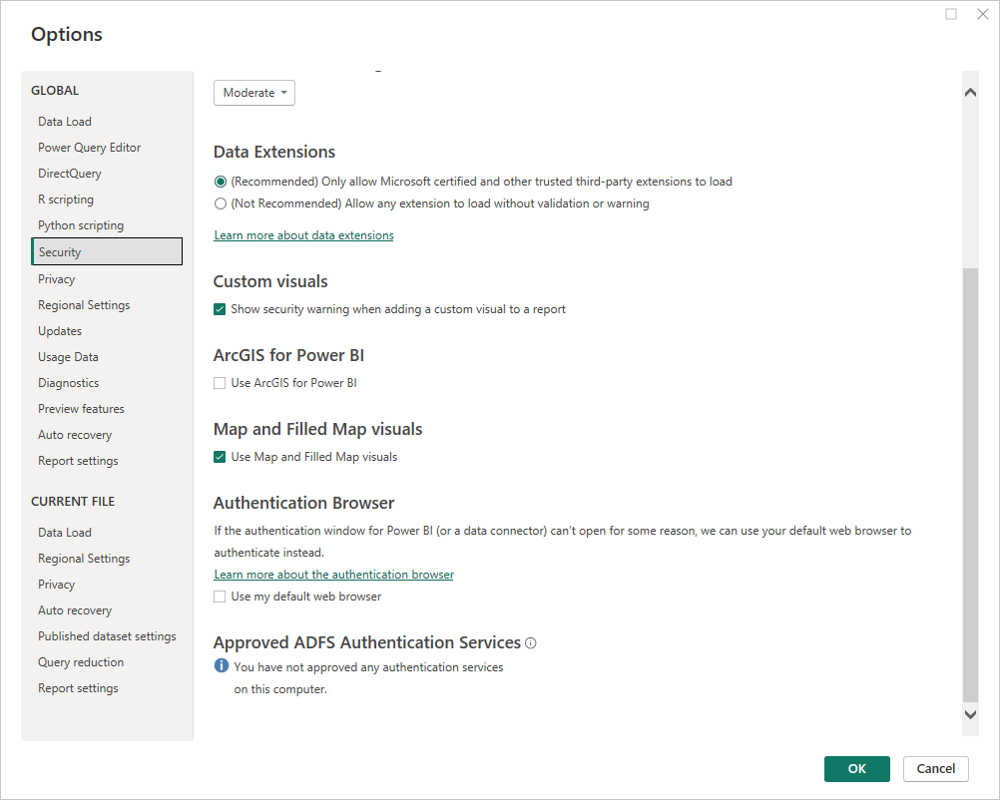

Alegem coloanele SalesAmount din tabelul FactInternetSales și CountryRegionCode din GimGeography. Automat va fi ales tabelul sub formă de hartă.

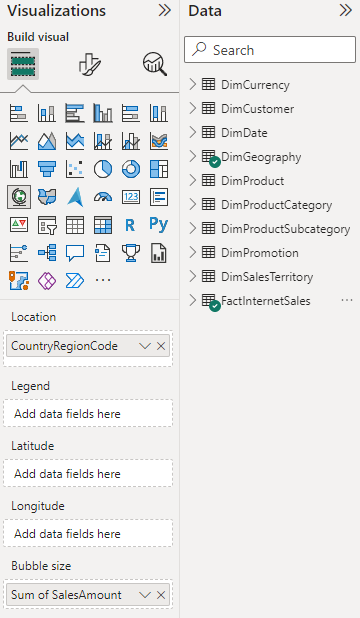

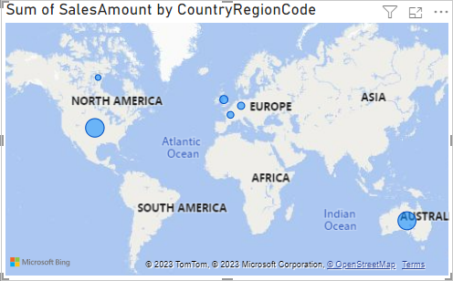

Observăm că vânzările în SUA sunt cele mai mari, urmate de Australia.

Alegem coloanele SalesAmount, SalesTerritoryCountry și EnglishProductCategoryName și tabelul de tip Matrix. Setăm SalesTerritoryCountry în rows, EnglishProductCategoryName în columns și Sum of SalesAmount în Values. Aceasta va crea un tabel cu cantitatea de vânzări clasate după categorii și țări.

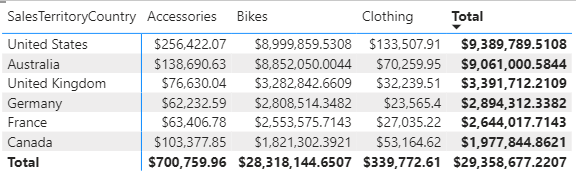

Observăm că bicicletele generează cele mai mari vânzări.