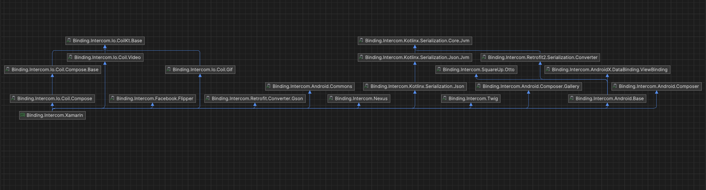

# Structura organizațională a "Amdaris SRL", subdiviziunea Chișinău

Practica de specialitate a fost efectuată în "Amdaris SRL", companie de outsourcing specializată în prestarea serviciilor de design, dezvoltare, testare și suport  software. De facto produsul oferit de companie sunt propriu-zis angajații, care sunt alocați la proiectele clienților și activează în cadrul lor asemenea dezvoltatorilor angajați direct de client, însă fără necesitatea de a stabili contracte și condiții de muncă pentru fiecare salariat. 

Amdaris SRL este divizată în mai multe filiale în Europa, printre cele mai mari fiind oficiile din Chișinău și Timișoara, focusate pe dezvoltarea softului, și cel din Bristol, care se ocupă de leadership și management. Practica a fost efectuată în oficiul din Chișinău în rolul de programator, iar de facto activitățile sunt de a participa la meetingurile stabilite, fie cu clientul sau interne, și de a efectua sarcinile stabilite de către client. 

În cadrul companiei este folosită metoda Agile pentru organizarea sarcinilor, în baza căreia programatorii stabiliți unui proiect sunt organizați în echipe de sub 10 persoane, iar fiecărei echipe i se stabilește un board cu sarcini ce trebuiesc efectuate până la sfârșitul unei perioade de două săptămâni, care este numită sprint. Astfel, la începutul fiecărui sprint clientul stabilește sarcinile prioritare pentru acea perioadă, iar fiecare programator din echipă își poate alege sarcinile pe care le va efectua. Deja la sfârșitul unui sprint programatorii arată clientului rezultatele obținute și se face o retrospectivă asupra sprintului dat, în care se discută ce a fost bine făcut în sprint și ce și cum ar fi trebuit de îmbunătățit pe viitor. De asemenea în fiecare zi programatorii arată ce au făcut în ziua trecută și ce vor face în continuare ca toți să fie la curent cu ce se întâmplă și ca mai mulți programatori să nu lucreze asupra aceleiași sarcini, de facto irosind timpul de lucru a unor angajați.

# Sarcinile formulate pentru perioada de practică. Analiza cerințelor.

Pentru perioada de practică sarcina de bază a fost de a migra o aplicație existentă de la Xamarin la .NET for iOS și Android. Microsoft încetează suportul Xamarin pe 1 mai 2024, însă împreună cu asta Xamarin nu va suporta și iOS 17, care la moment este versiunea cea mai nouă lansată de Apple, și astfel aplicația nu va putea fi lansată pe telefoane cu iOS actualizat. În procesul migrării Microsoft a extins parțial suportul pentru Xamarin, oferind suport pentru iOS 17, însă migrarea deja era în proces și astfel lucrul a fost continuat.

Fundamental, aplicația e un pdf reader cu posibilități de adăugare a anotațiilor și sincronizare cu serverul, însă de facto aceasta este un subscription service pentru note muzicale, astfel sunt necesare și măsuri de protecție precum blocarea screenshot-urilor, screen recording-ului și implementarea obfuscării codului pentru android.

Cerințele de bază sunt de a migra aplicația ca să folosească framework-ul .NET 8 în loc de Mono, pe baza căruia și lucrează Xamarin. Fundamental, ambele frameworkuri folosesc același limbaj de programare - C#, astfel pentru aplicații mici fără dependențe externe migrarea ar putea fi foarte ușoară, însă pentru aplicația noastră fiecare dependență poate aduce erori, astfel fiecare pachet extern trebuie să fie verificat și posibil înlocuit. În cazul în care nu sunt alternative pentru pachetele externe folosite, acestea trebuiesc fie recreate ca binding package-uri (în cazul în care se folosesc librării native), fie rescrise de la zero.

În urma acestei migrări trebuie să fie asigurată funcționalitatea aplicației, astfel este necesar un regression testing pentru asigurarea faptului că nimic în proces nu s-a stricat.

Astfel, în procesul migrării a fost formată următoarea listă de sarcini:

- Migrarea fișierelor .csproj din formatul Xamarin în stilul .NET SDK
- Verificarea fiecărui pachet dacă lucrează pe .NET
- Înlocuirea pachetelor nefuncționale fără dependențe native
- Înlocuirea pachetelor cu dependențe iOS
- Înlocuirea pachetelor cu dependențe Android
- Eliminarea pachetelor cu controale vechi pentru android, migrarea spre AndroidX
- Testarea extensivă a aplicației și soluționaera bugurilor

# Descrierea modalităților de soluționare a problemelor formulate

Migrarea a fost făcute de la Xamarin la .NET for iOS și Android, ambele framework-uri folosind limbajul de programare C#. 

În cadrul migrării au fost folosite IDE-urile Visual Studio Pro și Jetbrains Rider. De facto un singur IDE este suficient, însă Visual Studio primul primește suport pentru .NET 8, pe când Rider are o interfață mai comodă. De asemenea a fost folosit XCode 15 pentru crearea build-urilor și binding library-urilor pentru iOS. 

# Realizarea sarcinilor, Testarea produsului obținut. Validarea. Prezentarea rezultatelor obținute

## Migrarea fișierelor .csproj din formatul Xamarin în stilul .NET SDK

Acest proces n-a luat atât de mult timp, pur și simplu pentru că denumirile tag-urilor folosite în .csproj nu au fost schimbate esențial, astfel pur și simplu crearea unui proiect după formatul nou, transferarea tag-urilor cu pachete și copierea fișierelor a fost suficientă. Singurele schimbări au fost necesare în fișierele AndroidManifest.xml, care în Xamarin specifică versiunea sdk-ului android minim suportat, iar în .NET această proprietate este mutată în fișierele csproj. De asemenea unele tag-uri au fost redenumite, astfel migrarea lor a fost foarte ușoară.

## Verificarea fiecărui pachet dacă lucrează pe .NET

Procesul dat în mare parte a necesitat pur și simplu mult timp și nu efort. A fost necesară comentarea tuturor referințelor la pachete externe și decomentarea lor unul câte unul, verificând dacă în procesul de compilare apar erori din cauza pachetelor sau din cauza codului. În cazul în care apar probleme de pachete, atunci pachetul dat nu este compatibil cu .NET, și astfel trebuie înlocuit.

## Înlocuirea pachetelor nefuncționale

Toate pachetele excluse în procesul de mai sus trebuiesc înlocuite cu pachete noi. Unele dintre ele au avut alternative noi, însă majoritatea a trebuit să fie rescrisă sau importată nativ. Spre exemplu, Microsoft a înlocuit pachetul Xamarin.Essentials cu un tag pentru .NET care la compilare incorporează o listă de pachete interne cu funcțional asemănător. Problema acestei abordări este în faptul că versiunile pachetelor nu pot fi modificate, iar pentru că dependențele acestuia sunt ascunse, acestea creează conflicte cu pachetele necesare și direct importate în aplicație. Această problemă a fost soluționată prin înlocuirea tagului cu un propriu pachet Essentials, bazat pe Xamarin Essentials, codul căruia este open source și permis pentru utilizare în orice context. 

Fundamental aplicația dată este separată în trei părți: partea Core, partea pentru iOS și pentru Android. Partea Core conține business logica a aplicației și astfel trebuie să lucreze identic pe ambele platforme, fiind creată ca o librărie separată ce nu depind de platformă. În cazul în care este necesar ceva funcțional de platformă în Core, acesta este mutat în partea de platformă, sau se creează o interfață pentru funcționalul dat în Core, care apoi este realizată în proiectul de platformă și adusă în Core la executare prin patternul de Dependency Injection. Datorită acestei abordări, partea Core nu depinde de nicio platformă, iar în cazul apariției unei noi platforme logica de bază nu este modificată. E de menționat faptul că datorită acestei planificări, proiectele Core aproape nu au fost modificate în cadrul migrării, astfel business logica este garantată să lucreze.

În procesul migrării a fost modificată metoda de inițializare a pachetului, iar porțiunile nefolosite din Xamarin.Essentials au fost excluse. Ulterior pachetul propriu Essentials a fost completat cu un audio player, astfel decizia de a crea pachetul intern fiind reușită.

## Înlocuirea pachetelor cu dependențe iOS

În cazul în care pachetul exclus folosește librării native, acestea trebuiesc incluse cu ajutorul unei binding library, care creează legătura între două limbaje diferite (C# și Swift în cazul dat). În proiectul dat pachetul înlocuit e legat de librăria nativă Intercom, astfel se descarcă pachetul Intercom.xcframework și se include într-un nou iOS binding project. Ulterior se instalează Object Sharpie, instrumentul care și creează legăturile dintre partea de C# și Swift, și prin parametrii acestuia se indică librăria nativă:

```
sharpie bind --sdk=iphoneos17.0 --output="." -framework "NativeFrameworks/Intercom.xcframework/ios-arm64/Intercom.framework"
```

Această comandă creează fișierele ApiDefinitions.cs și StructsAndEnums.cs, care și sunt legătura dintre C# și Swift. Objective Sharpie poate lăsa atribute \[Verify\] în metodele în care nu este sigur că conversia a trecut cu succes, astfel după aceasta se verifică metodele cu atributul dat, care apoi se șterge. 

Ulterior în fișierul .csproj a binding project-ului se specifică referințele la fișierele ApiDefinitions.cs, StructsAndEnums.cs și Intercom.xcframework și se face build. În cazul în care nu apar erori, proiectul poate fi "împachetat" și astfel inclus în aplicație.

Există metode alternative de creare a unui iOS binding project, precum printr-un proiect XCode ce ia rolul de proxy și prin unificarea rezultatelor de compilare pentru x64 și arm64 într-un singur pachet, însă pentru că xcframework-urile automat sunt compilate sub ambele arhitecturi, acești pași nu sunt necesari și astfel pot fi eliminați. În final și binding project-ul devine mai ușor de menținut, necesitând doar chemarea unei comenzi în cazul în care e nevoie de o versiune mai nouă a pachetului nativ. De asemenea acest pachet nu a avut referințe la alte pachete native externe, și astfel procesul de creare a unui binding project a fost așa de ușor.

## Înlocuirea pachetelor cu dependențe Android

Pentru Android abordarea de creare a unui binding project este asemănătoare cu cea pentru iOS, cu singura diferență că nu este nevoie de un instrument extern pentru crearea legăturilor, proiectul singur își va da seama cum să creeze legătura dintre partea de C# și Android la compilare. Comparativ cu iOS însă, pachetele de Android au nevoie de mult mai multe dependențe externe pur și simplu pentru că Android-ul curat nu conține toate controalele de UI necesare pentru ca să lucreze ca un UI framework complet. Din cauza dependențelor multiple și apare dificultatea de creare a unui binding project bun.

În cazul aplicației date a fost necesară înlocuirea pachetului Intercom pentru Xamarin Android creat de nventive. Datorită faptului că pachetul este open-source, îl putem modifica cum dorim și astfel acesta a fost migrat la .NET for Android. Pachetul dat conține o mulțime de binding projecturi din cauza multiplelor dependențe necesare, ilustrate în următorul graf al proiectelor:



Această mulțime de proiecte reiese din faptul că fiecare binding project poate conține doar o singură librărie nativă, și orice librărie care nu este portată pentru .NET trebuie portată intern.

Într-o asemenea situație e extrem de importantă respectarea versiunilor pachetelor și asigurarea că ele nu creează conflicte cu pachetele din aplicație. Comparativ cu Java care are un mecanism puternic de management a pachetelor și în care e posibilă separarea dependențelor unui pachet de aplicație, în .NET acest fapt nu e așa de ușor de asigurat. Din cauza aceasta, procesul dat a luat mai mult timp și efort manual decât intelectual.

De asemenea, acest pachet cel mai probabil nu va fi actualizat în cazul apariției unei versiuni noi de Intercom, pur și simplu pentru că un simplu update nu merită tot efortul de asigurare a funcționalității pachetelor fără conflicte. Așadar, în cazul în care vor apărea probleme, cel mai probabil vor exista versiuni actuale de binding library-uri externe, și astfel nu va fi nevoie de suportat intern pachetul dat.

În rest, procesul este destul de ușor: se creează un binding project ca alternativă a unui proiect existent, se transferă toate dependențele acestuia, fie acestea dependențe de proiect sau pachete externe, și ulterior acesta se folosește în proiectele următoare, care vor forma Intercom-ul pentru Android.

O asemenea abordare are și problema importării multiplelor pachete necesare pentru o simplă funcționalitate. Fiecare binding project trebuiește "împachetat" și distribuit pe nuget feed-ul intern, folosit de dezvoltatorii aplicației. În Xamarin acest fapt putea fi evitat prin niște hack-uri care permiteau importarea multiplelor proiecte într-un pachet, însă în .NET aceste metode nu mai lucrează, și astfel fiecare pachet trebuie menținut, iar versiunea sa asigurată că este corectă. Inițial această problemă nu pare așa mare, însă în cazul în care este nevoie de împachetat 19 proiecte, orice efort depus pentru menținere devine extrem de repetitiv.

## Eliminarea pachetelor cu controale vechi pentru Android, migrarea spre AndroidX

În cadrul dezvoltării platformei Android au fost lansate mai multe seturi de controale UI, fiecare cu avantajele și problemele sale interne. Problema a început să se manifeste prin faptul că au fost create mai multe controale cu aceeași funcție, însă diferit suport pentru versiuni de Android și diferite costuri de peformanță și buguri. Într-un moment ai putea fi nesigur dacă folosești controlul corect sau se va strica ceva pe un telefon mai vechi. Pentru a rezolva această problemă Google a lansat AndroidX - o listă exhaustivă de controale refăcute pentru a asigura performanța și reverse-compatibilitatea la maxim, care sunt menite să înlocuiască tot haosul de controale lansate înainte de acesta. Microsoft a îmbrățișat această tactică și a permisss utilizarea exclusivă a controalelor AndroidX pe .NET for Android, iar înlocuirea celor vechi cu AndroidX a devenit un pas necesar pentru migrare.

Acest proces parțial a fost efectuat în cadrul verificării pachetelor funcționale, deoarece build-ul pe .NET for Android nu va merge dacă se folosesc librării cu controale UI vechi. Partea a doua este de a găsi versiuni alternative a controalelor vechi prestate de AndroidX. Propriu-zis înlocuirea controalelor este extrem de ușoară, însă problema este în faptul că la introducerea unor pachete noi este necesar de a verifica dacă acestea nu au referințe la librării cu controale vechi, iar codul de eroare la build după introducerea unui asemenea pachet nicicum nu alude la faptul că problema e în librăriile date. Astfel, cea mai mare parte a lucrului era de a ține minte de a folosi doar AndroidX și nu librării cu controale vechi.

Problema aceasta e înrăutățită de faptul că pachetele pentru Xamarin Android uneori pot lucra și pentru .NET for Android. Inițial acest fapt pare să fie bun, însă dacă considerăm faptul că nu toate pachetele Xamarin au fost migrate pe AndroidX, importarea unui asemenea pachet poate aduce la erori care iarăși, nicicum nu indică faptul că e din cauza pachetului nou adăugat și că controalele acestuia trebuiesc înlocuite. Acest fapt a devenit un fel de Unknown Unknowns - un fapt pe care numaidecât trebuie de ținut minte în cazul lucrului pe Android, și în caz că se uită acesta poate aduce la erori ce pot lua zile întregi pentru debugging.

## Testarea extensivă a aplicației

Datorită faptului că C# este un limbaj compilat, majoritatea erorilor posibile apar la etapa de compilare și nu în procesul de executare a programului, astfel la etapa în care programul se compilează și se poate de pornit, cele mai mari erori sunt deja rezolvate. Aceasta însă nu garantează faptul că totul va lucra ideal, astfel o testare extensivă este necesară.  

Spre exemplu, un bug întâlnit în timpul migrării a fost legat de un funcțional care folosește un audio player extern, care pică în momentul startului acestui funcțional. Codurile de eroare arată că problema e în pachetul audio playerului, și datorită faptului că acesta e open source putem investiga problema mai adânc. Problema a fost în faptul că pachetul dat este inițializat nu la compilare sau startul programului, ci la prima folosire a audio playerului, folosind astfel tehnica de lazy loading, iar pentru că pachetul dat este făcut pentru Xamarin și nu .NET, acesta nu găsește realizarea interfețelor sale și astfel pică la redarea oricărui sunet. Codul acestui pachet a fost modificat pentru a suporta .NET for iOS și Android și ulterior a fost inclus în pachetul Essentials, deoarece are o structură asemănătoare, în care interfețele și realizarea de platformă a acestora este separată. 

În final, toată aplicația a fost migrată la .NET for iOS și Android. Deși acest fapt nu aduce beneficii imediate, fără el aplicația nu va putea fi actualizată în cazul apariției unei noi versiuni de Android sau iOS, astfel migrarea este absolut necesară pentru ca aplicația să continuie să aducă profit.

# Concluzii

Autorul la momentul practicii deja activa în câmpul muncii la Amdaris SRL, astfel practica dată nu a fost cumva diferită de activitatea de zi cu zi înaintea acesteia. De facto cea mai valoroasă parte pentru un student ar fi utilizarea în practică a metodologiei Agile, care organizează procesul de muncă a unui programator și asigură sincronizarea tuturor angajaților și a clientului pe proiect. 

De asemenea este valoroasă experiența de lucru pe un proiect real ce aduce venit, care poate schimba modul în care se calculează costul unor feature-uri. Deși acestea pot fi ușor introduse pe partea de cod, ele trebuiesc foarte bine discutate cu stakeholder-ii companiei pentru a avea măcar o șansă pentru lansare. În continuare apare perspectiva de cost per benefit, în care timpul de lucru a programatorului este calculat pe balanță, împreună cu costurile recurente pentru servere și serviciile externe folosit. Spre exemplu, un server pentru notificări ar putea fi creat intern, însă considerând tot efortul de creare, optimizare și costurile pentru servere, devine evident faptul că e mai econom de a folosi un service extern pentru acest fapt. Același calcul a fost folosit pentru înlocuirea pachetelor externe cu cele intern menținute, deoarece acest proces necesită un timp semnificativ de la programator, astfel devenind o investiție serioasă pentru client. Implementarea pachetelor interne a trebuit să aducă un avantaj intrinsic pentru client, ca acesta să accepte o asemenea abordare și să nu zică că trebuie pur și simplu de importat un pachet extern existent.

În plan tehnic autorul nu crede că practica dată a adus o valoare mare. Desigur, cunoașterea faptului cum lucrează pachetele în .NET este necesară, însă considerând că toate aplicațiile Xamarin de pe piață vor trebui migrate până pe 1 mai 2024, autorul nu crede că în viitor va mai lucra asupra migrării unei aplicații Xamarin la .NET, astfel utilitatea cunoștințelor fiind restricționată doar pentru proiectul dat.

# Bibliografie

Upgrade Xamarin.Android, Xamarin.iOS, and Xamarin.Mac projects to .NET - https://learn.microsoft.com/en-us/dotnet/maui/migration/native-projects?view=net-maui-8.0

Xamarin.Android project migration - https://learn.microsoft.com/en-us/dotnet/maui/migration/android-projects?view=net-maui-8.0

Xamarin.Android binding project migration - https://learn.microsoft.com/en-us/dotnet/maui/migration/android-binding-projects?view=net-maui-8.0

Xamarin Apple project migration - https://learn.microsoft.com/en-us/dotnet/maui/migration/apple-projects?view=net-maui-8.0

Xamarin.iOS binding project migration - https://learn.microsoft.com/en-us/dotnet/maui/migration/ios-binding-projects?view=net-maui-8.0

Creating Bindings with Objective Sharpie - https://learn.microsoft.com/en-gb/xamarin/cross-platform/macios/binding/objective-sharpie/

Walkthrough: Bind an iOS Swift library - https://learn.microsoft.com/en-gb/xamarin/cross-platform/macios/binding/objective-sharpie/