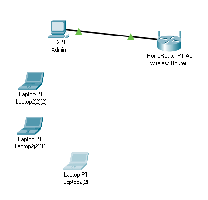
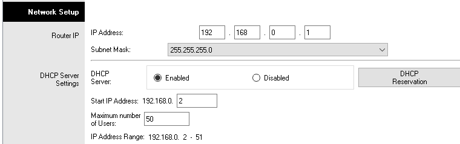
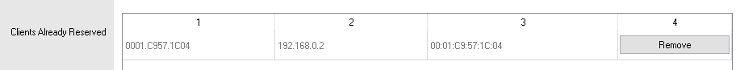
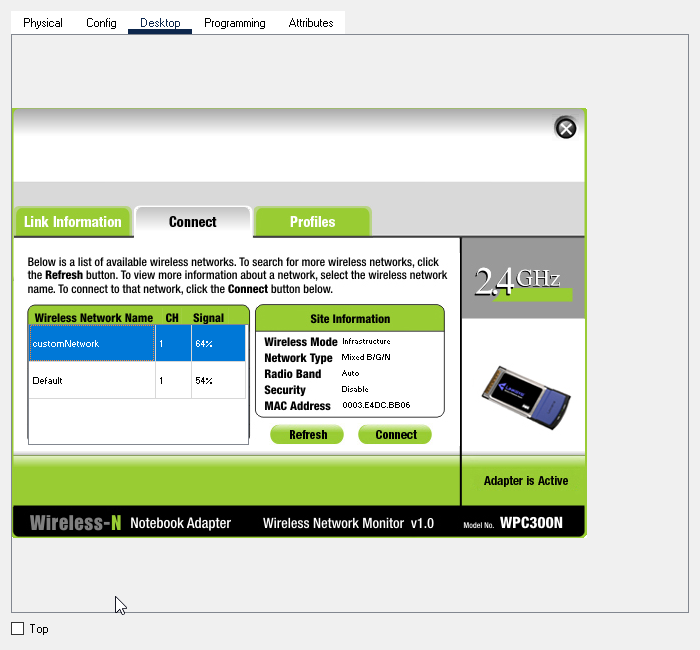
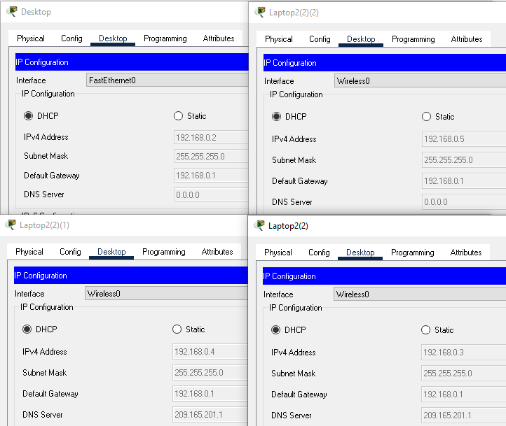
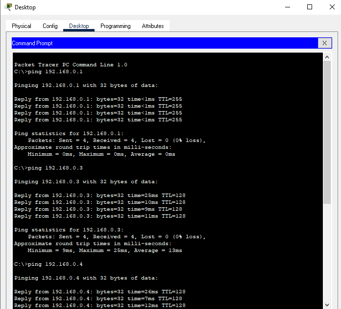
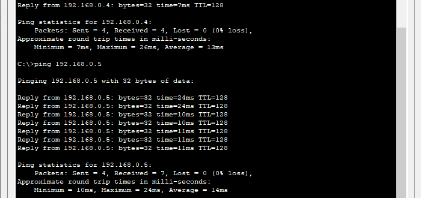

# Lucrare de laborator la TFF

Tema: Configurarea serviciului DHCP a Wi-Fi routerului

Student: Țurcanu Cristian, MIA2022

## Obiectivele

- Setarea topologiei rețelei;
- Configurarea serviciului DHCP pe routerul fără fir;
- Conectarea dispozitivelor la rețea și testarea conexiunii;

## Setarea topologiei

Pentru rețeaua dată avem nevoie de un router wireless de tip Home Router, un desktop ce va fi conectat prin fir și câteva laptop-uri ca clienți wireless. Conectăm desktopul la routerul wireless.

## Configurarea serviciului DHCP pe routerul fără fir

Deschidem interfața routerului, fereastra GUI. În secțiunea Network Setup setăm ip adresa dorită pentru router în rețeaua dată și masca de subrețea. Pornim serverul DHCP și setăm adresa de start pentru DHCP și numărul maxim de utilizatori. în cazul nostru setăm adresa routerului 192.168.0.1/24, adreas de start 192.168.0.2. iar numărul de utilizatori 50. 

În continuare vom rezerva o anumită adresă desktopului cu fir. Tastăm DHCP Reservation și adăugăm manual desktopul. Setăm o denumire oarecare, alegem adresa ip dorita din diapazonul DHCP pentru rezervare, iar adresa MAC o luăm din setările cartelei de rețea a desktopului. În cazul nostru avem adresa 192.168.0.2.

## Conectarea dispozitivelor la rețea și testarea conexiunii

Conectăm desktopul la router prin cablul Copper Straight-Through și setăm cartela de rețea ca să obțină adresa de ip prin DHCP. Laptop-urile le oprim, schimbăm cartela de rețea la una wireless, intrăm în interfața PC Wireless și conectăm laptopul la rețea fără fir. 

Verificăm dacă adresele IP au fost setate corect. Desktop-ul trebuie să aibă adresa 192.168.0.2, iar laptop-urile trebuie să fie în diapazonul 192.168.0.3-51.

Adresele au fost setate cu succes, deci verificăm conexiunea prin ping:

Vedem că conexiunea lucrează, deci rețeaua a fost setată cu succes.

<!-- Intrăm în setarea desktop-ului, categoria ip configuration și setăm configurarea să fie configurată prin DHCP -->